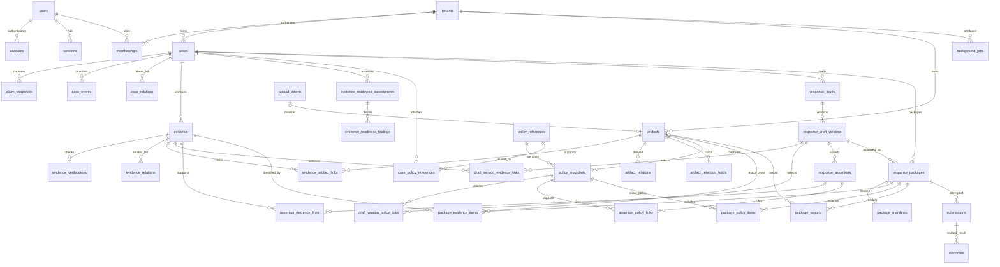

# Seller Shield physical database schema — MVP v0.1

## Status and authority

This document is the implementation-ready physical PostgreSQL schema
specification for Seller Shield MVP v0.1. It translates the conceptual model
in [`DATA_MODEL.md`](DATA_MODEL.md) into proposed tables, columns, constraints,
indexes, deletion behavior, and Row-Level Security policy intent.

- **DECIDED DESIGN / NOT IMPLEMENTED:** the product tables, columns,
  relationships, RLS policies, worker roles, and queue behavior below remain
  approved design, not an implemented business schema. The Slice 1A
  infrastructure/local-role and four GLOBAL auth-table exceptions are recorded
  separately below. No tenant/product-domain table has been implemented.
- **OPEN:** the operational and provider choices listed at the end remain open.
- **OUT OF SCOPE:** this document does not contain migration SQL, TypeScript
  Drizzle definitions, or application code; the local validation record is not
  proof of production controls or tenant isolation.

If sources conflict, domain meaning and the Case lifecycle remain authoritative
in `docs/domain/`; aggregate invariants remain authoritative in
`DATA_MODEL.md`; this document owns physical table shape and database policy
intent. Better Auth versions are selected in
[`ARCHITECTURE.md`](ARCHITECTURE.md#authentication-and-tenant-model).
The official Slice 1B-1 generation comparison is recorded below; actual
adapter/database validation must pass before the implementation is approved.

## Slice 1A foundation — IMPLEMENTED, local validation

On 2026-10-01, the infrastructure was validated against local PostgreSQL 18.6
with database `seller_shield`. `postgres` is setup/admin only;
`seller_shield_migrator` owns that database and its `public` schema;
`seller_shield_app` is the non-owner application runtime role. Both application
roles have LOGIN and are NOSUPERUSER, NOCREATEDB, NOCREATEROLE, NOREPLICATION,
and NOBYPASSRLS. The runtime has database CONNECT and public-schema USAGE, but
no database/schema CREATE privilege or membership in the migration role.

Installation, cluster data, and admin credentials are local-only outside the
repository; runtime/migration URLs are in ignored `.env.local`. There is no
committed production role provisioner. At Slice 1A approval the schema/journal
were empty, with only `drizzle.__drizzle_migrations` bookkeeping and zero applied
rows. Slice 1B-1's current four-table exception follows. Tenant tables, RLS,
worker roles, and the rest of the 39-table P0 design are not implemented.
Role separation does not itself establish tenant isolation.

## Slice 1B-1 foundation — IMPLEMENTED, local validation

On 2026-10-02, `drizzle/0000_auth-foundation.sql` was reviewed before application
and applied to the existing local PostgreSQL 18.6 database using the migration
owner. It creates exactly the four GLOBAL core tables below, with 34 columns,
two cascading User FKs, unique email/session token, and the approved indexes.
The migration journal has one applied row; repeated generation found no schema
changes and repeated migration was a no-op. No domain/plugin table was added.

`pnpm db:grant-auth` separately grants only SELECT/INSERT/UPDATE/DELETE on these
four tables to the role named by `DATABASE_URL`, using `DATABASE_MIGRATION_URL`.
It requires distinct roles on the same DB, checks role flags/inheritance and
migration ownership, and refuses elevated/schema-creating runtime roles. It
does not provision roles or grant ALL TABLES, ownership, TRUNCATE, REFERENCES,
TRIGGER, schema CREATE, or migration-bookkeeping access. New deployment roles
still require explicit provisioning outside this command.

Real adapter/session tests used `seller_shield_app`, not the owner. They
verified UUID returns, core CRUD, update timestamps, session lookup/expiry/
revocation, atomic Verification consumption, cleanup cascades, duplicate email/
token and invalid-FK rejection, actual columns/defaults/indexes/constraints and
ownership, and CREATE/ALTER denial. Missing runtime URL and wrong runtime
password tests fail without falling back to the migration URL or exposing
credentials. Fixture cleanup deletes only run-specific synthetic rows; no
database reset/TRUNCATE, test provider, or real sign-in is introduced.
Test read assertions deliberately use identifier-scoped adapter reads rather
than the internal lookup's global expired-row cleanup. A real expired sentinel
regression verifies isolation; production verification cleanup is unchanged.

## Design choices considered

Three choices materially shape the schema:

1. **Queue discovery:** make `background_jobs` a SYSTEM queue that a dedicated
   worker may claim across tenants, then require a separate leased,
   tenant-scoped transaction for domain access. This is selected over a broad
   `BYPASSRLS` role or a large SECURITY DEFINER API.
2. **Package history:** keep normalized immutable reference rows and an
   immutable manifest document. Reference rows enforce relationships and
   retention; the document freezes the approved representation.
3. **Artifact links:** use an explicit many-to-many
   `evidence_artifact_links` table. It supports evidence with no file, one
   evidence item with several files, and deliberate reuse of one immutable
   artifact without inventing a generic polymorphic object graph.

These choices are the smallest options that preserve tenant isolation,
auditability, and the already approved domain model.

## Physical conventions

### Naming and time

- Local development, CI, and initial deployment use PostgreSQL 18.6 as the
  operational baseline. Supported minor upgrades remain expected maintenance;
  changing the major version requires an explicit compatibility review.
- PostgreSQL objects use `snake_case`; domain documentation retains its
  PascalCase entity names.
- Business timestamps use `timestamptz` and are stored in UTC.
- Mutable records have `created_at` and `updated_at`. Immutable records have
  `created_at` or the more specific occurrence/capture timestamp and no
  `updated_at`.
- `date` is used only for a source's date-only effective value. Do not silently
  convert an unknown time zone into a timestamp.
- Human text uses `text`. Bounded values use named enums or named CHECK
  constraints, not arbitrary `varchar` lengths.
- SHA-256 values use `bytea` with a 32-byte CHECK. Display as hex only at an
  application boundary.

### Identifier strategy

The default identifier for Seller Shield and Better Auth core entity rows is
PostgreSQL `uuid` generated by `gen_random_uuid()`.

| Option | Assessment |
| --- | --- |
| UUID v4, database-generated | **Selected.** Native Drizzle support, no extra runtime library, safe distributed uniqueness, and `INSERT ... RETURNING` is sufficient for this MVP. Random index locality is acceptable at expected volume. |
| UUID v7, database-generated | PostgreSQL 18 provides native `uuidv7()`, but the MVP has no validated ordering or index-locality need that justifies changing the selected identifier semantics. |
| UUID v7, application-generated | Preserves locality across older PostgreSQL versions, but adds a generation dependency and clock behavior without validated scale benefit. |
| Sequential integer | Operationally simple but easier to enumerate and less suitable for independently created records or externally carried opaque IDs. |

Join tables use a natural composite primary key when the relationship itself
has no independent lifecycle. Better Auth session tokens, verification values,
and provider account identifiers remain `text`, separate from local UUID row
IDs. External marketplace identifiers remain `text` and never replace internal
IDs. Better Auth's `advanced.database.generateId: "uuid"` is the selected
configuration; generated PostgreSQL UUID defaults and adapter insert/return
behavior must be verified before the Slice 1B-1 migration.

UUIDs are opaque identifiers, not authorization controls. If measured insert
volume later justifies UUID v7, that is a deliberate migration, not a mixed
per-table default.

### Scope classes

- **GLOBAL:** authentication identity shared across tenants. No `tenant_id` and
  no tenant RLS; access is restricted to the Better Auth adapter/application
  role with explicit table grants, not ownership or broad schema privileges.
- **TENANT_ROOT:** the `tenants` ownership root. It has no `tenant_id` because it
  is not owned by another Tenant; actor-visible access is derived through
  Membership.
- **TENANT:** application data owned by one tenant. Every row carries
  `tenant_id`; RLS and tenant-aware foreign keys apply.
- **SYSTEM:** operational data whose discovery or administration legitimately
  spans tenants. Tenant attribution is present where applicable, but access is
  granted through dedicated roles/policies rather than ordinary tenant CRUD.

`memberships` is a TENANT boundary table that also supports actor-only discovery
before a tenant has been selected. Tenant is the ownership root for these rows,
not a tenant-owned row itself.

### Tenant-aware keys

Every UUID-keyed TENANT table other than natural-key join tables has:

- primary key `id`;
- required `tenant_id REFERENCES tenants(id) ON DELETE RESTRICT`; and
- `UNIQUE (tenant_id, id)` when another tenant table references it.

A tenant child references a tenant parent with a composite foreign key such as
`(tenant_id, case_id) -> cases(tenant_id, id)`. The apparently redundant
composite unique constraint exists specifically to make this FK possible and
to reject cross-tenant edges even if application code is wrong.

Same-Case relationships also carry `case_id` where that prevents evidence or a
draft from another Case in the same tenant being attached accidentally.
Relationships to GLOBAL `users` use `user_id` alone; the actor's tenant
authority still comes from Membership and application authorization.

### Mutability and delete defaults

- Claim snapshots, final Artifact identity/integrity fields, evidence verification
  records, draft versions, assertions, package contents/manifests, Submission
  revisions, Outcome revisions, CaseEvents, and AuditEvents are append-only.
- A mutable lifecycle status never permits mutation of an immutable payload.
- Tenant-domain foreign keys default to `ON DELETE RESTRICT`. Logical deletion
  or superseding is used instead of physical parent deletion.
- `CASCADE` is limited to Better Auth-owned Account/Session rows when a
  GLOBAL User is physically removed, and to no package/evidence history path.
- Actor FKs that must survive eventual identity deletion may use `SET NULL`
  only when a non-secret actor snapshot or AuditEvent retains attribution.
- Association rows used by approved packages are immutable and RESTRICTed.

### JSONB boundary

`jsonb` is allowed only for source-shaped immutable payloads, immutable package
documents, and bounded safe event metadata whose keys are versioned by the
owning record. Core identity, tenant, lifecycle, foreign keys, uncertainty,
digests, storage state, and query fields remain relational columns.

## Table inventory

| Scope | Area | Tables |
| --- | --- | --- |
| GLOBAL | Better Auth identity | `users`, `accounts`, `sessions`, `verifications` |
| TENANT_ROOT | Tenancy root | `tenants` |
| TENANT | Membership | `memberships` |
| TENANT | Cases | `cases`, `claim_snapshots`, `case_relations`, `case_events` |
| TENANT | Evidence/storage | `evidence`, `evidence_verifications`, `evidence_relations`, `evidence_readiness_assessments`, `evidence_readiness_findings`, `upload_intents`, `artifacts`, `artifact_relations`, `evidence_artifact_links`, `artifact_retention_holds` |
| TENANT | Policies | `policy_references`, `case_policy_references`, `policy_snapshots` |
| TENANT | Responses | `response_drafts`, `response_draft_versions`, `draft_version_evidence_links`, `draft_version_policy_links`, `response_assertions`, `assertion_evidence_links`, `assertion_policy_links` |
| TENANT | Packages/workflow | `response_packages`, `package_manifests`, `package_evidence_items`, `package_policy_items`, `package_exports`, `submissions`, `outcomes` |
| SYSTEM | Operations | `audit_events`, `background_jobs` |

The inventory contains 4 GLOBAL, 1 TENANT_ROOT, 32 TENANT, and 2 SYSTEM
tables. The 39-table design is a full P0 map, not a single-migration target.

No generic `entities`, `attachments`, `relations`, workflow-engine, or lookup
catalog table is proposed.

## GLOBAL Better Auth core tables

**IMPLEMENTED, locally validated:** Slice 1B-1 replaces the unimplemented
Auth.js contract with Better Auth 1.7.7's four core models. The authoritative
upstream field/required/default/index contract is the
[pinned core source](https://raw.githubusercontent.com/better-auth/better-auth/v1.7.7/packages/core/src/db/get-tables.ts),
with supported mapping described by the
[official Drizzle adapter](https://better-auth.com/docs/adapters/drizzle).
The names, UUIDs, UTC timestamps, and expiry-cleanup indexes below are Seller
Shield physical choices, not a claim that the untouched generator emits them.

| Better Auth logical model | Physical table | Drizzle export (`usePlural: true`) |
| --- | --- | --- |
| `user` | `users` | `schema.users` |
| `session` | `sessions` | `schema.sessions` |
| `account` | `accounts` | `schema.accounts` |
| `verification` | `verifications` | `schema.verifications` |

Pass the plural schema exports to `drizzleAdapter(db, { provider: "pg", schema,
usePlural: true })`; no per-model `modelName` overrides or singular aliases are
needed. Keep Drizzle properties at the canonical logical names (`emailVerified`, `userId`,
`createdAt`, etc.); map their SQL columns to `snake_case`. Do not introduce
duplicate schema aliases or a second auth namespace.

Each core table has `id uuid PRIMARY KEY DEFAULT gen_random_uuid()` and required
`created_at` / `updated_at timestamptz`, with creation defaults as supported by
the adapter. `updated_at` must advance through the adapter/Drizzle update
mechanism; `DEFAULT now()` alone does not update an existing row. No core table
has `tenant_id`, tenant RLS, or Seller Shield authorization roles.

### `users`

- **Purpose/scope:** GLOBAL application identity used by Better Auth; never a
  tenant or global-role record.
- **Key:** `id uuid PRIMARY KEY DEFAULT gen_random_uuid()`.
- **Columns:** `name text NOT NULL`, `email text NOT NULL`,
  `email_verified boolean NOT NULL DEFAULT false`, `image text NULL`,
  `created_at timestamptz NOT NULL`, `updated_at timestamptz NOT NULL`.
- **Constraints:** `UNIQUE (email)` after application-side canonicalization.
  Better Auth requires name and email. Slice 1B-2 must decide how real sign-in
  supplies a name without fabricating user data; that UI/registration decision
  does not add sign-in to the persistence foundation.
- **Delete:** physical deletion is not ordinary tenant deletion. Accounts and
  sessions may cascade; Membership RESTRICTs deletion until the identity is
  revoked/anonymized under an approved policy.
- **Indexes:** unique email only.
- **RLS:** none; adapter/application grants only.

### `accounts`

- **Purpose/scope:** GLOBAL Better Auth account linkage. Core nullable password
  and provider-token fields do not enable password or OAuth sign-in.
- **Key:** `id uuid PRIMARY KEY DEFAULT gen_random_uuid()`.
- **Columns:** `user_id uuid NOT NULL`, `account_id text NOT NULL`,
  `provider_id text NOT NULL`; nullable `access_token`, `refresh_token`,
  `id_token`, `scope`, and `password` text; nullable
  `access_token_expires_at` / `refresh_token_expires_at timestamptz`; required
  `created_at` / `updated_at timestamptz`.
- **FK/delete:** `user_id -> users(id) ON DELETE CASCADE` as Better Auth-owned
  identity cleanup; no tenant-domain FK.
- **Indexes:** `(user_id)`. The official core contract does not declare the old
  Auth.js composite provider key; do not silently carry it forward or invent
  an extra unique constraint without an adapter compatibility decision.
- **RLS:** none.

### `sessions`

- **Purpose/scope:** GLOBAL Better Auth database session.
- **Key:** `id uuid PRIMARY KEY DEFAULT gen_random_uuid()`.
- **Columns:** `user_id uuid NOT NULL`, `token text NOT NULL UNIQUE`,
  `expires_at timestamptz NOT NULL`, nullable `ip_address` / `user_agent text`,
  required `created_at` / `updated_at timestamptz`.
- **FK/delete:** `user_id -> users(id) ON DELETE CASCADE`.
- **Indexes:** unique token, `(user_id)`, `(expires_at)` for expiry cleanup.
- **RLS:** none. Possession of a session authenticates a User but does not grant
  access to any Tenant.

### `verifications`

- **Purpose/scope:** GLOBAL Better Auth verification storage, distinct from
  domain `evidence_verifications`. Creating the table does not implement the
  Magic Link plugin or establish its consumption/hash behavior.
- **Key:** `id uuid PRIMARY KEY DEFAULT gen_random_uuid()`.
- **Columns:** `identifier text NOT NULL`, `value text NOT NULL`,
  `expires_at timestamptz NOT NULL`, required
  `created_at` / `updated_at timestamptz`.
- **Indexes:** `(identifier)`, `(expires_at)` for cleanup. Neither identifier
  nor value is unique in the official core contract; no legacy composite token
  primary key or unique token constraint is retained.
- **Delete:** mutable/consumable auth infrastructure; consumed/expired records
  may be physically removed. This is not append-only evidence history.
- **RLS:** none. Verification values must never be logged or copied to audit
  metadata; storage/consumption semantics must be checked with Slice 1B-2's
  actual Magic Link configuration.

### Slice 1B-1 generation review — 2026-10-02

The pinned `auth@1.7.7 generate` CLI was run offline against the selected
configuration; its scratch output is not application code. Its four plural
tables, native UUID defaults/FKs, canonical properties with snake-case SQL
columns, required/nullable fields, unique email/token, non-unique verification
fields, cascade deletion, and update callbacks match the approved contract.
Seller Shield intentionally changes generated `timestamp` to `timestamptz`,
adds the two approved expiry indexes, and gives index names snake-case spelling.
`defaultRandom()` expresses the same PostgreSQL UUID function. Generated
relation helpers are not needed because experimental joins are not enabled.
No old Auth.js constraints or plugin tables are carried forward.

Before creating the Slice 1B-1 migration, compare the generated Better Auth
schema against every field, nullability/default, UUID/FK type, timestamp,
index, and mapping above. Review the final Drizzle schema and generated SQL;
prove adapter CRUD and session expiry/revocation on real PostgreSQL using the
non-owner runtime role. These checks passed for the current single migration;
repeat the generation comparison before future auth-schema changes. The only
auth migration target is these four GLOBAL tables plus
their constraints/indexes and narrowly scoped runtime grants. No organization
plugin, tenant tables, RLS, database rate-limit table, or other plugin schema
belongs in this migration. The foundation must not enable secondary storage or
session cookie caching; database sessions remain authoritative.

## TENANT_ROOT tenancy table

### `tenants`

- **Purpose:** seller workspace and ownership root.
- **Key:** `id uuid PRIMARY KEY DEFAULT gen_random_uuid()`.
- **Columns:** `name text NOT NULL`, `status text NOT NULL`,
  `created_at`, `updated_at`, optional `suspended_at`.
- **Checks:** status is `ACTIVE`, `SUSPENDED`, or `CLOSED`; timestamp/status
  combinations must be consistent.
- **Delete:** no ordinary physical delete. Closure starts a reviewed deletion
  workflow; child FKs RESTRICT.
- **Indexes:** `(status)` only if operations need it; tenant selection is driven
  by Membership.
- **RLS:** actor may SELECT tenants having an active Membership; OWNER may
  update its own tenant; creation uses a controlled onboarding transaction;
  no runtime DELETE.

## TENANT membership table

### `memberships`

- **Purpose:** authorizes a GLOBAL User in one Tenant.
- **Key:** `id uuid PRIMARY KEY DEFAULT gen_random_uuid()`.
- **Columns:** `tenant_id uuid NOT NULL`, `user_id uuid NOT NULL`,
  `role membership_role NOT NULL`, `status text NOT NULL`, `joined_at`,
  `revoked_at NULL`, `created_by_user_id uuid NULL`.
- **Constraints:** `UNIQUE (tenant_id, user_id)`; role is `OWNER`, `OPERATOR`,
  or `REVIEWER`; status is `ACTIVE` or `REVOKED`; active rows have no
  `revoked_at`, revoked rows do. At least one active OWNER must remain, enforced
  by the owner-management transaction rather than a row CHECK.
- **FK/delete:** Tenant RESTRICT; User and creator User RESTRICT/SET NULL only
  under the identity-deletion procedure.
- **Indexes:** `(user_id, status, tenant_id)` for workspace discovery and
  `(tenant_id, status, role)` for member administration.
- **RLS:** actor may SELECT its own memberships across tenants; active OWNER may
  SELECT/INSERT/UPDATE memberships for its tenant; revocation replaces DELETE.

## TENANT Case tables

### `cases`

- **Purpose:** workflow aggregate root; not an external claim row.
- **Key:** tenant UUID convention.
- **Columns:** `tenant_id`, `title text NOT NULL`, `marketplace text NULL`,
  `external_case_reference text NULL`, `external_order_reference text NULL`,
  `state case_state NOT NULL DEFAULT DRAFT`,
  `closure_disposition case_disposition NULL`, `due_at timestamptz NULL`,
  `last_activity_at timestamptz NOT NULL`, `created_by_user_id uuid NOT NULL`,
  `created_at`, `updated_at`, `logically_deleted_at NULL`.
- **Checks:** the state values exactly match `domain/claims.md`; disposition is
  non-null if and only if state is `CLOSED`; terminal-state mutation is
  permitted only through documented human transitions. Marketplace-specific
  details do not become columns until repeated queries require them.
- **Delete:** logical deletion only; all domain children RESTRICT physical
  deletion.
- **Indexes:** `(tenant_id, state, last_activity_at DESC, id DESC)` for Inbox;
  partial `(tenant_id, marketplace, external_order_reference)` and
  `(tenant_id, marketplace, external_case_reference)` where references are not
  null for duplicate review.
- **RLS:** active member SELECT; OWNER/OPERATOR INSERT; capability-checked
  updates; no runtime physical DELETE.

### `claim_snapshots`

- **Purpose:** immutable capture of an external claim/notice/revision.
- **Key:** tenant UUID convention.
- **Same-Case key:** `UNIQUE (tenant_id, case_id, id)` supports child FKs that
  must prove Case equality.
- **Columns:** `tenant_id`, `case_id`, `revision integer NOT NULL`,
  `source_type text NOT NULL`, `source_label text NULL`, `source_url text NULL`,
  `external_claim_reference text NULL`, `raw_text text NULL`,
  `raw_payload jsonb NULL`, `content_sha256 bytea NOT NULL`,
  `captured_at timestamptz NOT NULL`, `captured_by_user_id uuid NULL`,
  `capture_method text NOT NULL`, `created_at`.
- **Checks:** revision > 0; at least one of raw text/raw payload/source URL is
  present; digest is 32 bytes. `raw_payload` preserves source shape and is not a
  substitute for Case query fields.
- **Constraints/FKs:** `UNIQUE (tenant_id, case_id, revision)`; composite Case
  FK; actor User SET NULL only with retained attribution in events.
- **Delete/mutability:** immutable and RESTRICTed; a corrected source creates a
  new revision.
- **Indexes:** `(tenant_id, case_id, revision DESC)`.
- **RLS:** member SELECT; OWNER/OPERATOR INSERT; no UPDATE/DELETE.

### `case_relations`

- **Purpose:** reviewable same-tenant relation, initially possible duplicate.
- **Key:** tenant UUID convention.
- **Columns:** `tenant_id`, `left_case_id`, `right_case_id`,
  `relation_type text NOT NULL`, `status text NOT NULL`, `rationale text NULL`,
  `created_by_user_id`, `created_at`, `decided_by_user_id NULL`,
  `decided_at NULL`.
- **Checks:** cases differ and `left_case_id < right_case_id` stores UUIDs in
  canonical order;
  relation type initially `POSSIBLE_DUPLICATE`; status is `PROPOSED`,
  `ACCEPTED`, `REJECTED`, or `SUPERSEDED`.
- **Constraints:** both Case FKs include tenant; unique active relation per
  `(tenant_id, relation_type, left_case_id, right_case_id)`.
- **Delete:** decisions supersede rows; no physical delete.
- **Indexes:** both Case directions for Case Detail.
- **RLS:** member SELECT; OWNER/OPERATOR create; authorized humans decide; no
  DELETE and never automatic merge.

### `case_events`

- **Purpose:** immutable user-visible Case timeline.
- **Key:** tenant UUID convention.
- **Columns:** `tenant_id`, `case_id`, `event_kind text NOT NULL`,
  `actor_kind text NOT NULL`, `actor_user_id uuid NULL`,
  `source_job_id uuid NULL`, `occurred_at timestamptz NOT NULL`,
  `correlation_id uuid NULL`, `display_metadata jsonb NOT NULL DEFAULT '{}'`.
- **Checks:** actor kind and actor columns are consistent; display metadata is
  bounded, versioned, and contains no secrets/signed URLs/source payloads.
- **Delete/mutability:** append-only, Case RESTRICT.
- **Indexes:** `(tenant_id, case_id, occurred_at, id)`.
- **RLS:** member SELECT; INSERT only as part of an authorized domain
  transaction; no UPDATE/DELETE.

## TENANT Evidence and storage tables

### `evidence`

- **Purpose:** one conceptual, source-attributable Case evidence item.
- **Key:** tenant UUID convention, with same-Case uniqueness support
  `UNIQUE (tenant_id, case_id, id)`.
- **Columns:** `tenant_id`, `case_id`, `category evidence_category NOT NULL`,
  `title text NOT NULL`, `description text NULL`,
  `source_type text NOT NULL`, `source_label text NULL`,
  `source_reference text NULL`, `acquisition_method text NOT NULL`,
  `provenance_state provenance_state NOT NULL`,
  `observed_at timestamptz NULL`, `received_at timestamptz NULL`,
  `external_url text NULL`, `text_content text NULL`,
  `claim_snapshot_id uuid NULL`, `policy_reference_id uuid NULL`,
  `policy_snapshot_id uuid NULL`,
  `added_by_user_id uuid NOT NULL`, `created_at`, `updated_at`,
  `logically_deleted_at NULL`, `deleted_by_user_id NULL`.
- **Checks:** category uses the list in `domain/evidence.md`; `CLAIM_SOURCE`
  requires a same-Case ClaimSnapshot; `MARKETPLACE_POLICY` requires both a
  PolicyReference attached to the Case and one of its PolicySnapshots; at least
  one substantive form exists:
  Artifact link, text, external URL, ClaimSnapshot, or PolicySnapshot. The last
  rule needs deferred/service validation because an Artifact link is a child.
- **FK/delete:** ClaimSnapshot FK includes tenant/Case. PolicySnapshot FK
  includes tenant/reference, and CasePolicyReference FK includes
  tenant/Case/reference. Logical deletion hides new use but preserves package
  references; all source FKs RESTRICT.
- **Indexes:** `(tenant_id, case_id, logically_deleted_at, created_at, id)`;
  source-specific partial indexes only after observed queries.
- **RLS:** member SELECT; OWNER/OPERATOR INSERT/UPDATE/logical delete;
  REVIEWER may review/flag through application operations; no physical DELETE.

### `evidence_verifications`

- **Purpose:** immutable result of one named check, not universal authenticity.
- **Key:** tenant UUID convention.
- **Columns:** `tenant_id`, `case_id`, `evidence_id`, `check_type text NOT NULL`,
  `method text NOT NULL`, `result verification_result NOT NULL`,
  `notes text NULL`, `performed_by_kind text NOT NULL`,
  `performed_by_user_id uuid NULL`, `source_job_id uuid NULL`,
  `performed_at timestamptz NOT NULL`.
- **Constraints:** composite same-Case Evidence FK; actor/result consistency.
- **Delete/mutability:** append-only, RESTRICT.
- **Indexes:** `(tenant_id, case_id, evidence_id, performed_at DESC)`.
- **RLS:** member SELECT; authorized human or leased worker INSERT; no
  UPDATE/DELETE.

### `evidence_relations`

- **Purpose:** explicit relation such as conflict or duplicate between two
  Evidence rows in the same Case.
- **Key:** tenant UUID convention.
- **Columns:** `tenant_id`, `case_id`, `left_evidence_id`,
  `right_evidence_id`, `relation_type text NOT NULL`, `created_by_user_id`,
  `created_at`, `superseded_at NULL`.
- **Checks/constraints:** endpoints differ and
  `left_evidence_id < right_evidence_id` enforces canonical ordering; controlled
  `CONFLICTS_WITH`, `DUPLICATE_OF`, `RELATED_TO`; both composite Evidence FKs
  include tenant and Case; unique active pair/relation.
- **Delete:** supersede, do not erase.
- **Indexes:** both endpoint directions.
- **RLS:** same as Evidence mutation; no physical DELETE.

### `evidence_readiness_assessments`

- **Purpose:** immutable versioned Case-level readiness judgment.
- **Key:** tenant UUID convention.
- **Columns:** `tenant_id`, `case_id`, `revision integer NOT NULL`,
  `status readiness_status NOT NULL`, `summary text NULL`,
  `suggested_by_kind text NULL`, `confirmed_by_user_id uuid NULL`,
  `confirmed_at timestamptz NULL`, `created_at`.
- **Checks:** revision > 0; `REVIEWABLE` requires human confirmer/time;
  automated origin may suggest but never confirm.
- **Constraints:** `UNIQUE (tenant_id, case_id, revision)`; Case composite FK.
- **Delete/mutability:** append-only.
- **Indexes:** `(tenant_id, case_id, revision DESC)`.
- **RLS:** member SELECT; OWNER/OPERATOR/REVIEWER create according to domain
  capability; no UPDATE/DELETE.

### `evidence_readiness_findings`

- **Purpose:** structured missing/conflicting/unavailable/unverified item in one
  assessment.
- **Key:** tenant UUID convention.
- **Columns:** `tenant_id`, `case_id`, `assessment_id`,
  `finding_type text NOT NULL`, `description text NOT NULL`,
  `evidence_id uuid NULL`, `related_evidence_id uuid NULL`,
  `ordinal integer NOT NULL`.
- **Checks/FKs:** ordinal >= 0; finding type is `MISSING`, `CONFLICTING`,
  `UNAVAILABLE`, or `UNVERIFIED`; evidence references are optional but, when
  present, must match tenant/Case; conflicting endpoints differ.
- **Constraints:** unique assessment ordinal.
- **Delete/mutability:** immutable with its assessment.
- **Indexes:** assessment order only; no speculative text index.
- **RLS:** same as assessment.

### `upload_intents`

- **Purpose:** tenant-authorized staging reservation; prevents a staging object
  from being treated as final evidence.
- **Key:** tenant UUID convention.
- **Columns:** `tenant_id`, `case_id`, `requested_by_user_id`,
  `staging_provider text NOT NULL`, `staging_bucket text NOT NULL`,
  `staging_key text NOT NULL`, `expected_media_type text NULL`,
  `expected_byte_length bigint NULL`, `expected_sha256 bytea NULL`,
  `state text NOT NULL`, `expires_at timestamptz NOT NULL`,
  `validated_at NULL`, `finalized_artifact_id uuid NULL`, `failure_code NULL`,
  `created_at`, `updated_at`.
- **Checks:** length >= 0, digest 32 bytes, state is `INITIATED`, `UPLOADED`,
  `VALIDATED`, `FINALIZED`, `EXPIRED`, or `FAILED`; `FINALIZED` requires exactly
  one finalized Artifact and validation time; terminal rows cannot return to an
  earlier state.
- **Constraints:** unique provider/bucket/staging key; unique non-null finalized
  Artifact; all Case/Artifact FKs tenant-aware.
- **Delete:** expired staging bytes are provider-cleanup candidates. The row may
  be retained for the selected audit period and then hard-deleted only if it
  never finalized; a finalized intent RESTRICTs.
- **Indexes:** `(state, expires_at)` for cleanup and `(tenant_id, case_id,
  created_at DESC)`.
- **RLS:** member SELECT for its Case; OWNER/OPERATOR create/finalize; leased
  evidence-processing worker update; no arbitrary DELETE.

### `artifacts`

- **Purpose:** identity and lifecycle of immutable final stored bytes.
- **Key:** tenant UUID convention.
- **Columns:** `tenant_id`, `storage_provider text NOT NULL`,
  `bucket text NOT NULL`, `object_key text NOT NULL`,
  `object_version text NULL`, `media_type text NOT NULL`,
  `byte_length bigint NOT NULL`, `sha256 bytea NOT NULL`,
  `artifact_kind artifact_kind NOT NULL`,
  `availability_state artifact_availability NOT NULL`,
  `finalized_at timestamptz NOT NULL`, `created_by_user_id uuid NULL`,
  `created_by_job_id uuid NULL`, `retention_eligible_at timestamptz NOT NULL`,
  `deletion_requested_at NULL`, `physically_deleted_at NULL`,
  `deletion_reason text NULL`, `created_at`.
- **Checks:** length >= 0; digest 32 bytes; kind `ORIGINAL` or `DERIVED`;
  availability `AVAILABLE`, `QUARANTINED`, `DELETION_PENDING`, or `DELETED`;
  deleted state requires deletion timestamp/reason and retains all identity,
  version, size, media, and digest metadata.
- **Constraints:** unique storage identity
  `(storage_provider, bucket, object_key, object_version)` with a separate
  partial unique rule for providers without object versions. Digest is not
  unique. An Artifact row is created only after upload validation/promotion;
  staging keys never appear here.
- **Delete/mutability:** object identity, kind, byte length, digest, and
  finalized time are immutable. Lifecycle fields may advance only. Row
  deletion is RESTRICTed permanently; byte deletion leaves a tombstone.
- **Indexes:** `(tenant_id, availability_state, retention_eligible_at)` for
  cleanup; storage identity unique index; no global digest lookup by default.
- **RLS:** member SELECT only through authorized application use; OWNER/OPERATOR
  initiate lifecycle changes; leased worker may finalize/mark deletion for its
  tenant/job; no physical row DELETE.

### `artifact_relations`

- **Purpose:** immutable provenance from a derived Artifact to source
  Artifacts.
- **Key:** composite
  `(tenant_id, derived_artifact_id, source_artifact_id, relation_type)`.
- **Columns:** `processor_version text NULL`, `created_at`.
- **Checks/FKs:** endpoints differ, both composite Artifact FKs share tenant;
  relation type initially `DERIVED_FROM`; derived endpoint must be DERIVED,
  enforced in the creation service/transaction.
- **Delete:** RESTRICT; never cascade provenance.
- **Indexes:** reverse `(tenant_id, source_artifact_id)`.
- **RLS:** member SELECT; authorized application/leased worker INSERT; no
  UPDATE/DELETE.

### `evidence_artifact_links`

- **Purpose:** explicit zero-to-many Evidence ↔ Artifact association.
- **Key:** composite `(tenant_id, evidence_id, artifact_id, link_role)`.
- **Columns:** `case_id`, `link_role text NOT NULL`, `ordinal integer NOT NULL`,
  `linked_by_user_id uuid NULL`, `linked_by_job_id uuid NULL`, `linked_at`,
  `unlinked_at NULL`, `unlink_reason NULL`.
- **Checks/FKs:** role is `SOURCE`, `SUPPORTING`, or `DERIVED_PREVIEW`; ordinal
  >= 0; Evidence FK includes tenant/Case, Artifact FK includes tenant. An
  original and a preview are separate Artifacts.
- **Constraints:** unique active `(tenant_id, evidence_id, link_role, ordinal)`.
- **Delete:** unlink timestamp replaces deletion. Approved package items do not
  depend on the active-link flag and remain immutable.
- **Indexes:** `(tenant_id, case_id, evidence_id, unlinked_at)` and reverse
  Artifact lookup.
- **RLS:** member SELECT; OWNER/OPERATOR link/unlink; no physical DELETE.

### `artifact_retention_holds`

- **Purpose:** makes a concrete reason that blocks physical byte deletion
  queryable and auditable.
- **Key:** tenant UUID convention.
- **Columns:** `tenant_id`, `artifact_id`, `hold_type text NOT NULL`,
  `response_package_id uuid NULL`, `starts_at timestamptz NOT NULL`,
  `hold_until timestamptz NULL`, `released_at timestamptz NULL`,
  `reason text NOT NULL`, `created_by_user_id uuid NULL`, `created_at`.
- **Checks/FKs:** `PACKAGE` hold requires package ID; `LEGAL`/`SECURITY` may not;
  PACKAGE hold also requires a finite `hold_until`; release cannot precede
  start. Artifact and optional Package FKs include tenant.
- **Constraints:** one active package hold per package/artifact pair.
- **Delete:** release, never erase. Physical byte deletion is permitted only
  when no active hold exists and retention eligibility has passed. A database
  trigger or restricted deletion procedure must enforce this cross-table rule
  when deletion is implemented; a row CHECK cannot.
- **Indexes:** `(tenant_id, artifact_id, released_at, hold_until)`.
- **RLS:** authorized members may view; package approval inserts PACKAGE holds;
  only approved retention administration releases non-package holds; no DELETE.

## TENANT Policy tables

### `policy_references`

- **Purpose:** stable tenant-local identity for one attributable policy source.
- **Key:** tenant UUID convention.
- **Columns:** `tenant_id`, `marketplace text NOT NULL`,
  `source_url text NOT NULL`, `title text NULL`,
  `created_by_user_id uuid NOT NULL`, `created_at`, `updated_at`,
  `archived_at NULL`.
- **Constraints:** `UNIQUE (tenant_id, marketplace, source_url)` after URL
  normalization. This does not claim the source is official.
- **Delete:** archive; Snapshot and Case links RESTRICT.
- **Indexes:** unique source identity.
- **RLS:** member SELECT; OWNER/OPERATOR create/update/archive; REVIEWER read.

### `case_policy_references`

- **Purpose:** explicit same-tenant attachment/reuse of a PolicyReference by a
  Case.
- **Key:** composite `(tenant_id, case_id, policy_reference_id)`.
- **Columns:** `linked_by_user_id`, `linked_at`, `unlinked_at NULL`,
  `unlink_reason NULL`.
- **FK/delete:** Case and PolicyReference composite FKs; RESTRICT, unlink
  instead of deletion.
- **Indexes:** active links by Case and reverse reference lookup.
- **RLS:** member SELECT; OWNER/OPERATOR link/unlink; no physical DELETE.

### `policy_snapshots`

- **Purpose:** immutable point-in-time representation used for review.
- **Key:** tenant UUID convention plus
  `UNIQUE (tenant_id, policy_reference_id, revision)`.
- **Relationship key:** `UNIQUE (tenant_id, policy_reference_id, id)` supports
  exact Snapshot/reference composite FKs.
- **Columns:** `tenant_id`, `policy_reference_id`, `revision integer NOT NULL`,
  `retrieved_at timestamptz NOT NULL`, `effective_on date NULL`,
  `version_label text NULL`, `captured_text text NULL`,
  `captured_artifact_id uuid NULL`, `content_sha256 bytea NOT NULL`,
  `provenance_state provenance_state NOT NULL`, `capture_method text NOT NULL`,
  `captured_by_user_id uuid NULL`, `created_at`.
- **Checks:** revision > 0; at least captured text or Artifact; digest 32 bytes.
  Source URL is reached through the immutable reference identity and also
  copied into an approved manifest snapshot.
- **FK/delete:** Reference and optional Artifact composite FKs RESTRICT.
- **Indexes:** `(tenant_id, policy_reference_id, revision DESC)` and optional
  retrieved time.
- **RLS:** member SELECT; OWNER/OPERATOR INSERT; no UPDATE/DELETE.

## TENANT Response tables

### `response_drafts`

- **Purpose:** stable editable-history container for a Case.
- **Key:** tenant UUID convention, with
  `UNIQUE (tenant_id, case_id, sequence_no)` and
  `UNIQUE (tenant_id, case_id, id)`.
- **Columns:** `tenant_id`, `case_id`, `sequence_no integer NOT NULL`,
  `status text NOT NULL`, `created_by_user_id`, `created_at`, `updated_at`,
  `archived_at NULL`.
- **Checks:** sequence > 0; status `ACTIVE` or `ARCHIVED`. Current version is
  obtained by highest version number; no mutable pointer is needed.
- **Delete:** archive; versions/packages RESTRICT.
- **Indexes:** `(tenant_id, case_id, sequence_no)`.
- **RLS:** member SELECT; OWNER/OPERATOR/REVIEWER create/edit container; no
  physical DELETE.

### `response_draft_versions`

- **Purpose:** immutable complete response text version.
- **Key:** tenant UUID convention; carries `case_id` and
  `UNIQUE (tenant_id, case_id, id)`.
- **Columns:** `tenant_id`, `case_id`, `response_draft_id`,
  `version_no integer NOT NULL`, `origin draft_origin NOT NULL`,
  `body_text text NOT NULL`, `created_by_user_id uuid NULL`,
  `source_job_id uuid NULL`, `provider_name text NULL`, `model_name text NULL`,
  `prompt_version text NULL`, `input_digest bytea NULL`, `created_at`.
- **Checks:** version > 0; MANUAL forbids provider/model/job fields;
  AI_ASSISTED requires source job and provider/model/prompt attribution; digest
  when present is 32 bytes.
- **Constraints:** `UNIQUE (tenant_id, response_draft_id, version_no)`;
  composite Draft FK includes tenant/Case.
- **Delete/mutability:** append-only and RESTRICTed.
- **Indexes:** `(tenant_id, response_draft_id, version_no DESC)` and
  `(tenant_id, case_id, created_at DESC)`.
- **RLS:** member SELECT; authorized human or leased AI job INSERT; no
  UPDATE/DELETE.

### `draft_version_evidence_links`

- **Purpose:** selected Evidence set for one DraftVersion without copying
  evidence payloads.
- **Key:** composite `(tenant_id, draft_version_id, evidence_id)`.
- **Columns:** `case_id`, `ordinal integer NOT NULL`, `created_at`.
- **Constraints/FKs:** DraftVersion and Evidence composite FKs both include
  tenant/Case; unique version ordinal.
- **Delete/mutability:** immutable with DraftVersion, RESTRICT.
- **Indexes/RLS:** version order; member SELECT and DraftVersion creation-only
  INSERT; no UPDATE/DELETE.

### `draft_version_policy_links`

- **Purpose:** selected exact PolicySnapshots for one DraftVersion.
- **Key:** composite `(tenant_id, draft_version_id, policy_snapshot_id)`.
- **Columns:** `case_id`, `policy_reference_id`, `ordinal`, `created_at`.
- **Constraints/FKs:** DraftVersion tenant/Case; Snapshot tenant/reference; and
  CasePolicyReference tenant/Case/reference must all match; unique ordinal.
- **Delete/mutability:** immutable, RESTRICT.
- **Indexes/RLS:** version order; same as Evidence selection links.

### `response_assertions`

- **Purpose:** traceability for material assertions, not every sentence.
- **Key:** tenant UUID convention; carries tenant/Case/DraftVersion.
- **Relationship key:** `UNIQUE (tenant_id, case_id, id)` supports same-Case
  assertion link FKs.
- **Columns:** `tenant_id`, `case_id`, `draft_version_id`,
  `ordinal integer NOT NULL`, `assertion_kind text NOT NULL`,
  `assertion_text text NOT NULL`,
  `support_state assertion_support_state NOT NULL`, `created_at`.
- **Checks:** ordinal >= 0; assertion kind `FACT`, `POLICY`, `LIMITATION`, or
  `INFERENCE`; support state uses the approved five values. A `SUPPORTED`
  factual assertion requires at least one Evidence or Policy link, enforced by
  approval validation because child rows cannot be tested by a row CHECK.
- **Constraints:** unique DraftVersion ordinal; composite version FK includes
  tenant/Case.
- **Delete/mutability:** immutable with version.
- **Indexes:** `(tenant_id, draft_version_id, ordinal)`.
- **RLS:** member SELECT; created only with DraftVersion; no UPDATE/DELETE.

### `assertion_evidence_links`

- **Purpose:** explicit support/contradiction link to same-Case Evidence.
- **Key:** composite `(tenant_id, assertion_id, evidence_id, relation_type)`.
- **Columns:** `case_id`, `relation_type text NOT NULL`, `created_at`.
- **Checks/FKs:** relation `SUPPORTS` or `CONTRADICTS`; both parent FKs include
  tenant/Case.
- **Delete/mutability/RLS:** immutable, RESTRICT; same access as assertion.

### `assertion_policy_links`

- **Purpose:** exact PolicySnapshot basis for a material assertion.
- **Key:** composite `(tenant_id, assertion_id, policy_snapshot_id,
  relation_type)`.
- **Columns:** `case_id`, `policy_reference_id`, relation type, `created_at`.
- **Constraints/FKs:** Assertion tenant/Case; Snapshot tenant/reference;
  CasePolicyReference confirms attachment to the Case.
- **Delete/mutability/RLS:** immutable, RESTRICT; same access as assertion.

## TENANT Package, submission, and outcome tables

### `response_packages`

- **Purpose:** human-approved immutable response basis and lifecycle identity.
- **Key:** tenant UUID convention; carries Case and
  `UNIQUE (tenant_id, case_id, package_version)`.
- **Relationship key:** `UNIQUE (tenant_id, case_id, id)` supports immutable
  manifest/item/submission composite FKs.
- **Columns:** `tenant_id`, `case_id`, `package_version integer NOT NULL`,
  `draft_version_id uuid NOT NULL`, `approved_by_user_id uuid NOT NULL`,
  `approved_at timestamptz NOT NULL`, `template_version text NOT NULL`,
  `status text NOT NULL`, `retention_until timestamptz NOT NULL`,
  `invalidated_at NULL`, `invalidated_by_user_id NULL`,
  `invalidation_reason NULL`, `created_at`.
- **Checks:** version > 0; status `APPROVED`, `SUPERSEDED`, or `VOIDED`;
  invalidation fields are all-or-none. Lifecycle status may change, but draft,
  reviewer, approval, template, manifest, and item rows never do.
- **FK/delete:** exact DraftVersion composite FK includes tenant/Case; all child
  history RESTRICTs deletion.
- **Indexes:** `(tenant_id, case_id, package_version DESC)` and status.
- **RLS:** member SELECT; OWNER/REVIEWER approval INSERT and lifecycle update;
  no physical DELETE. Approval transaction also creates Manifest, item rows,
  retention holds, CaseEvent/AuditEvent, and Case transition atomically.

### `package_manifests`

- **Purpose:** immutable one-to-one canonical approval document.
- **Key/FK:** `response_package_id uuid PRIMARY KEY` plus `tenant_id`,
  `case_id`; composite Package FK.
- **Columns:** `schema_version integer NOT NULL`,
  `canonicalization_version text NOT NULL`, `manifest_document jsonb NOT NULL`,
  `manifest_sha256 bytea NOT NULL`, `created_at`.
- **Checks:** positive schema version and 32-byte digest. The document contains
  no signed URLs or secrets.
- **Delete/mutability:** immutable, RESTRICT.
- **Indexes:** no JSON index; Package PK lookup is sufficient.
- **RLS:** member SELECT; approval transaction only INSERT; no UPDATE/DELETE.
- **Blocking detail:** exact canonical serialization must be selected and test
  vectors approved before Slice 5 package implementation. The column shape does
  not depend on which deterministic serialization is chosen.

### `package_evidence_items`

- **Purpose:** normalized immutable references behind the Evidence/Artifact
  portion of the manifest and retention calculation.
- **Key:** composite `(tenant_id, response_package_id, ordinal)`.
- **Columns:** `case_id`, `evidence_id uuid NOT NULL`, `artifact_id uuid NULL`,
  `artifact_sha256 bytea NULL`, `artifact_object_version text NULL`,
  `evidence_snapshot jsonb NOT NULL`, `created_at`.
- **Checks/FKs:** Evidence must match tenant/Case; optional Artifact must match
  tenant; `artifact_id` and `artifact_sha256` are both null or both present;
  object version may remain null when the provider does not expose versioning;
  digest is 32 bytes. Multiple rows may select multiple Artifacts for one
  Evidence item.
- **Delete/mutability:** immutable and RESTRICT. Each non-null Artifact creates
  an `artifact_retention_holds` row in the approval transaction.
- **Indexes:** `(tenant_id, evidence_id)`, `(tenant_id, artifact_id)` for holds
  and audit.
- **RLS:** member SELECT; approval-only INSERT; no UPDATE/DELETE.

### `package_policy_items`

- **Purpose:** normalized immutable exact policy basis.
- **Key:** composite `(tenant_id, response_package_id, ordinal)`.
- **Columns:** `case_id`, `policy_reference_id`, `policy_snapshot_id`,
  `content_sha256 bytea NOT NULL`, `captured_artifact_id uuid NULL`,
  `artifact_sha256 bytea NULL`, `policy_snapshot jsonb NOT NULL`, `created_at`.
- **Constraints/FKs:** Package tenant/Case; Snapshot tenant/reference; Case link
  tenant/Case/reference; optional captured Artifact tenant; content digest is
  32 bytes and captured Artifact/digest are both null or both present.
- **Delete/mutability:** immutable, RESTRICT. A non-null captured Artifact
  creates a PACKAGE retention hold in the approval transaction.
- **Indexes/RLS:** reference/snapshot lookup; approval-only INSERT and member
  SELECT.

### `package_exports`

- **Purpose:** idempotent render request/result for one approved package.
- **Key:** tenant UUID convention.
- **Columns:** `tenant_id`, `case_id`, `response_package_id`,
  `template_version text NOT NULL`, `renderer_version text NOT NULL`,
  `state text NOT NULL`, `artifact_id uuid NULL`, `requested_by_user_id`,
  `requested_at`, `completed_at NULL`, `failure_code NULL`, `created_at`.
- **Checks:** state `PENDING`, `AVAILABLE`, or `FAILED`; AVAILABLE requires a
  derived Artifact/completion time; FAILED has no Artifact and has safe code.
- **Constraints:** unique `(tenant_id, response_package_id, template_version,
  renderer_version)`; Package and Artifact FKs tenant-aware.
- **Delete:** retained with Package; no cascade. Retry updates lifecycle or
  reuses the same logical export, never changes package content. Making an
  export AVAILABLE creates a PACKAGE retention hold for its derived Artifact.
- **Indexes:** Case/package history and pending export status.
- **RLS:** member SELECT; authorized member request INSERT; leased PDF worker
  status update; no DELETE.

### `submissions`

- **Purpose:** append-only record/revision of a human-performed external
  submission attempt.
- **Key:** tenant UUID convention.
- **Relationship keys:** `UNIQUE (tenant_id, case_id, id)` and
  `UNIQUE (tenant_id, case_id, response_package_id, attempt_no, id)` support
  same-Case Outcome and correction-chain FKs.
- **Columns:** `tenant_id`, `case_id`, `response_package_id`,
  `attempt_no integer NOT NULL`, `revision integer NOT NULL`,
  `supersedes_submission_id uuid NULL`, `destination text NOT NULL`,
  `external_reference text NULL`, `submitted_at timestamptz NOT NULL`,
  `recorded_by_user_id uuid NOT NULL`, `recorded_at timestamptz NOT NULL`,
  `notes text NULL`.
- **Cardinality:** one Package may have multiple actual attempts. Each attempt
  may have multiple append-only metadata revisions. Revision 1 represents the
  first record; a correction increments revision and points to the prior row.
- **Constraints:** attempt/revision > 0;
  `UNIQUE (tenant_id, response_package_id, attempt_no, revision)`;
  `UNIQUE (supersedes_submission_id)` keeps a linear correction chain;
  a composite self-FK on tenant/Case/Package/attempt/superseded ID requires the
  prior row to be from the same logical attempt.
- **Delete/mutability:** immutable, RESTRICT. An erroneous record is corrected,
  not overwritten or deleted.
- **Indexes:** `(tenant_id, case_id, submitted_at DESC, id)` and Package attempt
  order.
- **RLS:** member SELECT; OWNER/REVIEWER INSERT; no UPDATE/DELETE. First valid
  recorded attempt may trigger the human `PACKAGE_READY -> SUBMITTED`
  transition in the same transaction.

### `outcomes`

- **Purpose:** append-only seller-entered outcome and correction history for a
  Submission.
- **Key:** tenant UUID convention.
- **Relationship key:**
  `UNIQUE (tenant_id, case_id, submission_id, id)` supports the correction
  self-FK.
- **Columns:** `tenant_id`, `case_id`, `submission_id`,
  `revision integer NOT NULL`, `supersedes_outcome_id uuid NULL`,
  `category outcome_category NOT NULL`, `notes text NULL`,
  `source text NOT NULL DEFAULT 'SELLER_ENTERED'`,
  `observed_at timestamptz NULL`, `recorded_by_user_id uuid NOT NULL`,
  `recorded_at timestamptz NOT NULL`.
- **Cardinality:** a Submission has zero or more Outcome revisions forming one
  linear correction chain. The current Outcome is the row not superseded by
  another row; no mutable `current` flag is needed.
- **Constraints:** revision > 0; unique `(tenant_id, submission_id, revision)`;
  unique non-null `supersedes_outcome_id`; correction remains in the same
  tenant/Case/Submission through a composite self-FK. Category exactly follows
  `domain/claims.md`.
- **Delete/mutability:** immutable, RESTRICT.
- **Indexes:** `(tenant_id, submission_id, revision DESC)` and Case timeline.
- **RLS:** member SELECT; OWNER/OPERATOR/REVIEWER INSERT; no UPDATE/DELETE. The
  first outcome record may trigger the human `SUBMITTED -> RESOLVED`
  transition; corrections do not invent another transition.

## SYSTEM operational tables

### `audit_events`

- **Purpose/scope:** append-only security/administrative trace. SYSTEM because
  it includes tenant-attributed and narrow global-auth events and is not an
  ordinary tenant CRUD aggregate.
- **Key:** `id uuid PRIMARY KEY DEFAULT gen_random_uuid()`.
- **Columns:** `tenant_id uuid NULL`, `actor_kind text NOT NULL`,
  `actor_user_id uuid NULL`, `source_job_id uuid NULL`,
  `action text NOT NULL`, `result text NOT NULL`, `target_type text NOT NULL`,
  `target_id uuid NULL`, `occurred_at timestamptz NOT NULL`,
  `request_id uuid NULL`, `correlation_id uuid NULL`,
  `safe_metadata jsonb NOT NULL DEFAULT '{}'`.
- **Checks:** actor fields consistent; result controlled `SUCCEEDED`/`DENIED`/
  `FAILED`; tenant is required for tenant-domain actions; metadata excludes
  source content, response text, tokens, secrets, and signed URLs.
- **FK/delete:** optional Tenant/User use RESTRICT or SET NULL with retained
  snapshot attribution; target is deliberately descriptive, not a polymorphic
  FK or data-access path.
- **Indexes:** `(tenant_id, occurred_at DESC, id)`,
  `(tenant_id, target_type, target_id, occurred_at DESC)`, and global action
  lookup only for authorized security operations.
- **Access:** runtime and worker roles receive append-only INSERT through the
  audit boundary and no general SELECT/UPDATE/DELETE. A separate audit-reader
  role is required. Tenant-facing Case timelines use `case_events`, not this
  table.

### `background_jobs`

- **Purpose/scope:** SYSTEM queue whose rows are tenant-attributed. Cross-tenant
  discovery is limited to queue claiming; it grants no domain-table access.
- **Key:** `id uuid PRIMARY KEY DEFAULT gen_random_uuid()`.
- **Tenant attribution key:** `UNIQUE (tenant_id, id)` supports tenant-safe
  attribution FKs from results/events created by a job.
- **Columns:** `tenant_id uuid NOT NULL`, `job_type text NOT NULL`,
  `target_type text NOT NULL`, `target_id uuid NOT NULL`,
  `idempotency_key text NOT NULL`, `state job_state NOT NULL`,
  `priority smallint NOT NULL DEFAULT 0`,
  `attempt_count integer NOT NULL DEFAULT 0`, `max_attempts integer NOT NULL`,
  `available_at timestamptz NOT NULL`, `locked_at NULL`,
  `locked_by text NULL`, `lock_token uuid NULL`, `lease_expires_at NULL`,
  `last_error_code text NULL`, `last_error_summary text NULL`,
  `result_type text NULL`, `result_id uuid NULL`,
  `created_by_user_id uuid NULL`, `correlation_id uuid NULL`,
  `created_at`, `started_at NULL`, `completed_at NULL`.
- **Checks:** attempts between 0 and max; max > 0; RUNNING requires all lock
  and lease fields; PENDING has none; SUCCEEDED requires result identity and
  completion; FAILED requires completion/error. Error summary is bounded and
  contains no customer content, prompts, secrets, or signed URLs.
- **Constraints:** `UNIQUE (tenant_id, job_type, idempotency_key)`; Tenant FK
  RESTRICT. `target_type/target_id` is the one justified polymorphic locator;
  its exact tenant/target is revalidated after claim under tenant RLS.
- **Indexes:** partial claim index on
  `(priority DESC, available_at, created_at, id)` for PENDING rows; partial
  lease-recovery index on `(lease_expires_at)` for RUNNING rows; tenant target
  and idempotency lookups.
- **Delete:** retain terminal metadata for the selected operations/audit period;
  deletion never removes domain results or AuditEvents.
- **RLS/access:** RLS remains enabled even though the table is SYSTEM scoped.
  The request application role may INSERT and SELECT rows only for its current
  authorized tenant and cannot claim/update them. The dedicated worker role
  has an explicit policy permitting SELECT/UPDATE on this table across tenants
  for claim/lease operations only. Neither role owns the table or has
  `BYPASSRLS`; no worker policy applies to tenant-domain tables.

## Background worker transaction model

The selected lifecycle is:

1. An authorized tenant transaction inserts an idempotent SYSTEM job.
2. A worker starts a short queue transaction, selects one eligible PENDING job
   with `FOR UPDATE SKIP LOCKED`, changes it to RUNNING, increments attempts,
   records worker/lock token/lease, and commits.
3. The worker starts a **new** transaction, sets transaction-local
   `app.tenant_id`, `app.job_id`, `app.worker_id`, and lock-token context, and
   verifies that the RUNNING, unexpired job lease belongs to that tenant.
4. Tenant RLS admits the worker only when that leased job context is valid.
   The application service revalidates `target_type/target_id` belongs to the
   same tenant and that the job kind permits the operation.
5. Slow provider/storage/render work happens outside the queue row lock. Domain
   result creation is idempotent.
6. A short completion transaction updates the job only when ID, RUNNING state,
   worker, and lock token still match. Expired ownership cannot complete it.
7. Retry returns the same row to PENDING with a later `available_at`; exhausted
   work becomes FAILED. Processing is at-least-once.

The worker can access one job's tenant while it owns a valid lease, but cannot
query any other tenant in that transaction. AI/PDF/evidence jobs cannot approve
a package, record a submission/outcome, or transition a Case into a
human-decision state.

## RLS and authorization model

### Context establishment

An ordinary request uses one database transaction:

1. Authenticate a GLOBAL User through the server-side Better Auth session.
2. Begin a transaction as the non-owner, non-BYPASSRLS application role.
3. Set only `app.actor_id` with transaction-local semantics.
4. Resolve an ACTIVE Membership where `user_id` is the actor and `tenant_id` is
   the requested Tenant. Membership's bootstrap SELECT policy permits the actor
   to see only its own rows without tenant context.
5. Authorize the required application capability.
6. Only after Membership succeeds, set `app.tenant_id` transaction-locally.
7. Perform tenant reads/writes only through that transaction handle.
8. Commit/rollback, clearing context before the pooled connection is reused.

Tenant selection uses the same actor-only discovery policy and may SELECT only
the actor's active Memberships and their TENANT_ROOT rows. It cannot read
domain data. A requested Tenant ID is an application lookup input, never a
database authorization context before Membership succeeds. Missing, malformed,
or empty context fails closed. Application authorization decides whether an
operation is allowed; RLS is defense in depth and does not replace capability
checks.

### Policy expression intent

- `SELECT` predicates compare row `tenant_id` with transaction-local tenant and
  require either an active actor Membership or a valid leased worker job.
- `INSERT`/`UPDATE` use both `USING` and `WITH CHECK` so rows cannot be moved to
  another tenant.
- Physical DELETE is denied on durable domain tables. Cleanup tables have a
  narrow controlled path, never general member DELETE.
- Table owners, migration roles, and any role with `BYPASSRLS` are unavailable
  to application and worker processes. Tenant tables use FORCE RLS where the
  migration design supports it.
- Composite tenant FKs remain mandatory because RLS does not validate
  relationship correctness.

### Per-table RLS matrix

`Member` below still means the application capability check has passed.

| Tenant boundary/domain table | SELECT | INSERT | UPDATE | DELETE |
| --- | --- | --- | --- | --- |
| `tenants` | Active member; actor-only discovery | Controlled onboarding | OWNER; status workflow | Deny |
| `memberships` | Self discovery; tenant OWNER administration | OWNER | OWNER role/revoke, preserving last OWNER | Deny |
| `cases` | Active member | OWNER/OPERATOR | Capability + state machine | Deny; logical only |
| `claim_snapshots` | Active member | OWNER/OPERATOR | Deny | Deny |
| `case_relations` | Active member | OWNER/OPERATOR | Authorized decision fields only | Deny |
| `case_events` | Active member | Authorized domain transaction/leased worker | Deny | Deny |
| `evidence` | Active member | OWNER/OPERATOR | OWNER/OPERATOR metadata/lifecycle | Deny |
| `evidence_verifications` | Active member | Authorized human/leased worker | Deny | Deny |
| `evidence_relations` | Active member | OWNER/OPERATOR | Supersede only | Deny |
| `evidence_readiness_assessments` | Active member | OWNER/OPERATOR/REVIEWER per capability | Deny | Deny |
| `evidence_readiness_findings` | Active member | With assessment creation | Deny | Deny |
| `upload_intents` | Case member | OWNER/OPERATOR | Initiator finalize or leased worker lifecycle | Controlled expiry cleanup only |
| `artifacts` | Authorized member | Finalization transaction/leased worker | Lifecycle only | Deny row deletion |
| `artifact_relations` | Authorized member | Derivation transaction/leased worker | Deny | Deny |
| `evidence_artifact_links` | Active member | OWNER/OPERATOR/leased worker | Unlink lifecycle only | Deny |
| `artifact_retention_holds` | Authorized member | Package approval/retention admin | Release only by retention authority | Deny |
| `policy_references` | Active member | OWNER/OPERATOR | OWNER/OPERATOR archive/metadata | Deny |
| `case_policy_references` | Active member | OWNER/OPERATOR | Unlink only | Deny |
| `policy_snapshots` | Active member | OWNER/OPERATOR | Deny | Deny |
| `response_drafts` | Active member | OWNER/OPERATOR/REVIEWER | Archive/metadata by same roles | Deny |
| `response_draft_versions` | Active member | Authorized human/leased AI worker | Deny | Deny |
| `draft_version_evidence_links` | Active member | With version creation | Deny | Deny |
| `draft_version_policy_links` | Active member | With version creation | Deny | Deny |
| `response_assertions` | Active member | With version creation | Deny | Deny |
| `assertion_evidence_links` | Active member | With assertion creation | Deny | Deny |
| `assertion_policy_links` | Active member | With assertion creation | Deny | Deny |
| `response_packages` | Active member | OWNER/REVIEWER approval | OWNER/REVIEWER lifecycle only | Deny |
| `package_manifests` | Active member | Approval transaction | Deny | Deny |
| `package_evidence_items` | Active member | Approval transaction | Deny | Deny |
| `package_policy_items` | Active member | Approval transaction | Deny | Deny |
| `package_exports` | Active member | Authorized member | Leased PDF worker lifecycle | Deny |
| `submissions` | Active member | OWNER/REVIEWER | Deny | Deny |
| `outcomes` | Active member | OWNER/OPERATOR/REVIEWER | Deny | Deny |

Every migration implementing this matrix needs real-PostgreSQL tests for all
four commands, missing context, wrong tenant IDs, pooled-connection reuse,
table-owner differences, and the worker lease branch. In particular, if User A
is a member of Tenant A but not Tenant B, forcing Tenant B as the requested ID
must fail Membership acquisition and must not expose Case or Evidence rows.

## Enum and checked-text strategy

Use PostgreSQL enums only for values that are closed, cross-table, and already
authoritative:

- `membership_role`: `OWNER`, `OPERATOR`, `REVIEWER`;
- `case_state`: the seven states in `domain/claims.md`;
- `case_disposition`: the six terminal dispositions in `domain/claims.md`;
- `evidence_category`: the nine categories in `domain/evidence.md`;
- `provenance_state`: `KNOWN`, `PARTIAL`, `UNKNOWN`;
- `verification_result`: `PASSED`, `FAILED`, `INCONCLUSIVE`;
- `readiness_status`: `NOT_ASSESSED`, `GAPS_IDENTIFIED`, `REVIEWABLE`;
- `draft_origin`: `MANUAL`, `AI_ASSISTED`;
- `assertion_support_state`: `SUPPORTED`, `CONFLICTING`, `MISSING`,
  `UNVERIFIED`, `INFERENCE`;
- `artifact_kind`: `ORIGINAL`, `DERIVED`;
- `artifact_availability`: `AVAILABLE`, `QUARANTINED`, `DELETION_PENDING`,
  `DELETED`;
- `outcome_category`: the five values in `domain/claims.md`;
- `job_state`: `PENDING`, `RUNNING`, `SUCCEEDED`, `FAILED`.

Use CHECK-backed text for relation kinds, event/action kinds, upload/export
states, assertion kinds, source/capture methods, and package lifecycle because
they are table-local and may expand. Use unconstrained but application-
validated text for providers, models, marketplaces, media types, external
destinations, source URLs, policy labels, and error codes. Do not add lookup
tables for these values in P0.

## Query and index review

Only credible MVP queries receive indexes:

| Query | Supporting index |
| --- | --- |
| Tenant Case Inbox | `cases(tenant_id, state, last_activity_at DESC, id DESC)` |
| Case Detail | PK/composite tenant FKs; child tables begin with tenant/Case |
| Evidence by Case | `evidence(tenant_id, case_id, logically_deleted_at, created_at, id)` |
| Latest ClaimSnapshot | `claim_snapshots(tenant_id, case_id, revision DESC)` |
| Latest DraftVersion | `response_draft_versions(tenant_id, response_draft_id, version_no DESC)` |
| Package history by Case | `response_packages(tenant_id, case_id, package_version DESC)` |
| Pending job claim | partial PENDING index on priority/available/created/id |
| Expired job lease | partial RUNNING index on `lease_expires_at` |
| Membership authorization | unique tenant/user plus user/status/tenant discovery index |
| Case timeline | `case_events(tenant_id, case_id, occurred_at, id)` |
| Security investigation | Audit tenant/time and tenant/target/time indexes |
| Artifact deletion eligibility | Artifact availability/eligibility plus active hold lookup |

Do not add full-text, trigram, JSON GIN, digest-deduplication, marketplace-wide,
or analytics indexes before a measured query and privacy review require them.

## Retention and package reproducibility

Approval immutability is not infinite retention.

- While all required Artifact bytes remain retained, an approved package can
  be reconstructed from its immutable manifest, exact references, digests,
  template version, and retained objects.
- Package/reference/manifest rows never mutate when Evidence is unlinked or
  logically deleted.
- Physical byte deletion requires retention eligibility, no active hold, a
  recorded authorized decision, and provider deletion confirmation.
- After permitted byte deletion, Artifact identity, provider/object-version
  tombstone, size, media type, digest, PackageManifest, normalized package
  items, and AuditEvent remain. The system must report that binary
  reconstruction is no longer possible.
- No document claims indefinite legal retention. Concrete periods and backup/
  processor deletion remain policy choices required before real evidence.

No `CASCADE` path from Case, Evidence, User, PolicyReference, or Draft may erase
an approved Package, manifest/item, Submission, Outcome, Artifact tombstone, or
active retention hold.

## Mermaid ER diagram

The diagram omits routine timestamp/actor columns but shows the physical table
boundaries and important cardinalities.

## Slice migration boundary

The full model is designed now, but migrations remain slice-scoped:

- **Slice 0:** no database schema, roles, migration tooling, or PostgreSQL test
  harness. This slice establishes only the executable application foundation.
- **Slice 1A:** implemented migration mechanism and real PostgreSQL smoke/test
  path; empty schema, no product SQL migrations.
- **Slice 1B-1:** Better Auth persistence foundation; only the four GLOBAL core
  tables above, runtime grants, and real adapter integration tests are implemented.
- **Slice 1B-2:** Magic Link, transactional email, and sign-in UI. Review any
  plugin-specific schema needs explicitly; no tenant/domain tables.
- **Slice 1C:** `tenants`, `memberships`, and their RLS policies/tests. Seller
  Shield alone owns this authorization model; no auth organization plugin.
- **Slice 1D:** `cases`, `claim_snapshots`, and `case_events`, with their tenant
  constraints and RLS tests. Slice 1E adds manual Create → Inbox → Detail.
- **Slice 2:** Evidence, upload, Artifact, provenance, and retention structures.
- **Slice 3:** readiness and policy structures.
- **Slice 4:** DraftVersion, source links, assertions, and AI jobs only after
  manual drafting works.
- **Slice 5:** Package, manifest/items, exports, holds, and Submission after the
  canonicalization format is approved.
- **Slice 6:** Outcome revisions and remaining validation instrumentation.

Do not generate one P0-wide initial migration merely because this document
describes the entire model.

## Implementation validation obligations

Before a slice is considered implemented, its migration/Drizzle work must
prove:

1. the pinned Better Auth adapter accepts the GLOBAL schema and generated
   schema/SQL were reviewed against this contract before the auth migration;
2. each tenant composite FK rejects a cross-tenant parent ID;
3. all four RLS commands fail closed for wrong/missing context;
4. pooled connections do not retain actor/tenant/job context;
5. tests use runtime/worker roles, not the owner/migration role;
6. immutable rows and fields cannot be silently overwritten;
7. no CASCADE removes approved-package history or retained Artifact identity;
8. staging upload cannot become Evidence without final Artifact validation;
9. physical deletion is blocked by an active hold and leaves a tombstone;
10. a worker can claim across the SYSTEM queue without `BYPASSRLS`, then can
    access only the leased job tenant under tenant RLS;
11. job retry creates at most one logical result per idempotency key;
12. manual Draft → approval → export works without an LLM;
13. AI/jobs cannot approve, submit, resolve, or close a Case; and
14. approved package metadata survives permitted byte deletion while the UI
    accurately reports loss of binary reconstruction.

## Remaining decisions before affected implementation

- Better Auth and its Drizzle adapter are selected at stable 1.7.7, not yet
  installed. Verify generated schema, plural resolution, UUID defaults, and real
  adapter/session behavior during Slice 1B-1 before approval. Drizzle is pinned
  in Slice 1A and PostgreSQL 18.6 is the selected operational baseline.
- Choose provisional evidence/export retention periods, legal/product bases,
  backup expiry, and processor deletion before Slice 2 stores real data.
- Select storage provider/region, upload limits, checksum behavior, quarantine,
  and malware-inspection capability before real evidence upload.
- Select deterministic manifest canonicalization and approve test vectors
  before Slice 5; earlier slices are not blocked.
- Choose job lease duration, backoff, maximum attempts, and safe error-summary
  limits before the first async worker is enabled; table shape is not blocked.
- Choose transactional email provider/region/data terms before Slice 1B-2
  sends real email; this does not block Slice 1B-1. Choose AI provider/data terms
  before any real data is sent to it.
- Define database-level enforcement mechanism (trigger or restricted procedure)
  for active Artifact retention holds before physical byte deletion is enabled.

Marketplace connectors, automated policy crawling, buyer reputation, global
case correlation, autonomous submission, and a general queue/workflow system
remain out of scope rather than unresolved schema work.

## External references

- [Better Auth Drizzle adapter](https://better-auth.com/docs/adapters/drizzle)
- [Better Auth core database models and UUID configuration](https://better-auth.com/docs/concepts/database)
- [Better Auth 1.7.7 core schema source](https://raw.githubusercontent.com/better-auth/better-auth/v1.7.7/packages/core/src/db/get-tables.ts)
- [Drizzle PostgreSQL column types](https://orm.drizzle.team/docs/column-types)
- [PostgreSQL UUID functions](https://www.postgresql.org/docs/current/functions-uuid.html)
- [PostgreSQL Row Security Policies](https://www.postgresql.org/docs/current/ddl-rowsecurity.html)
- [PostgreSQL transaction-local `set_config`](https://www.postgresql.org/docs/current/functions-admin.html)
- [PostgreSQL `SELECT` locking and `SKIP LOCKED`](https://www.postgresql.org/docs/current/sql-select.html)
