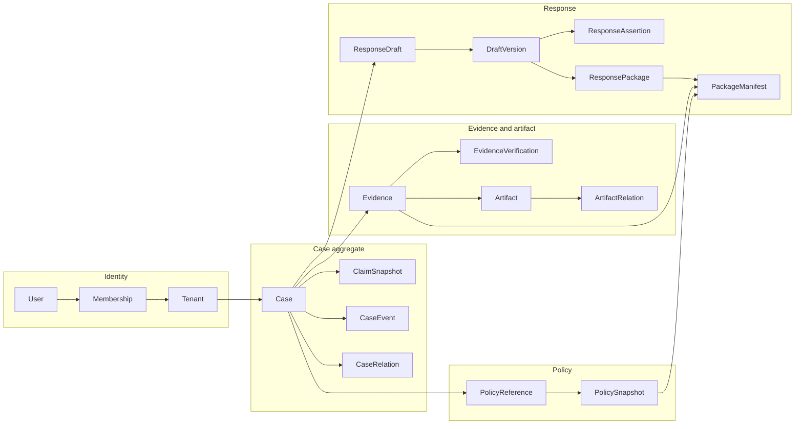
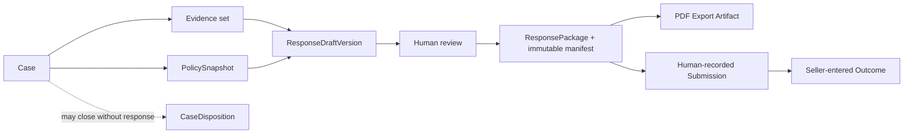
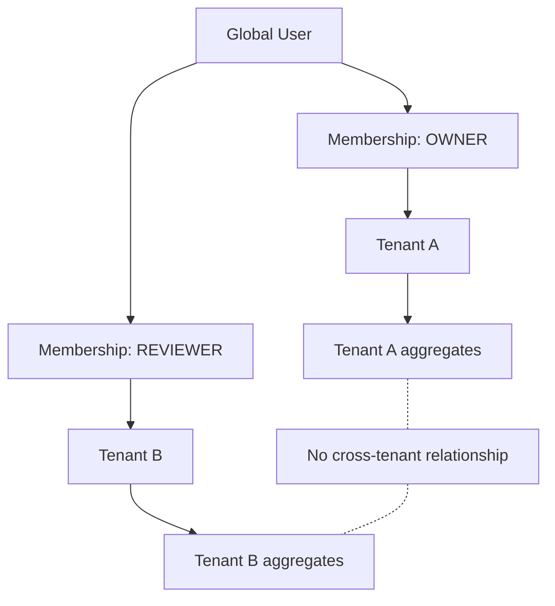
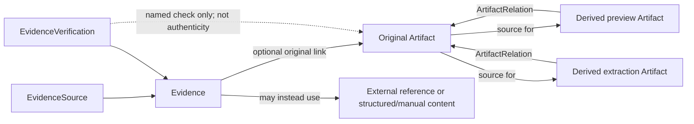

# Seller Shield domain and data model — MVP v0.1

## Status and authority

This document defines the approved conceptual/domain data model for MVP v0.1
and gives constraints for a later physical PostgreSQL/Drizzle schema. It does
not define database columns, SQL, migrations, or implemented behavior.

- **DECIDED:** aggregate boundaries, ownership, relationships, lifecycle
  invariants, tenant/RLS strategy, package snapshot semantics, and minimum job
  semantics described here.
- **PLANNED / NOT IMPLEMENTED:** every table, constraint, RLS policy, storage
  record, job, and application behavior described here.
- **OPEN:** provider choices, retention periods, physical deletion schedules,
  and the operational parameters listed at the end of this document.

The source-of-truth boundaries are:

- product behavior and MVP scope: [`PRODUCT.md`](PRODUCT.md);
- authoritative Case state machine and dispositions:
  [`domain/claims.md`](domain/claims.md);
- evidence, policy, and response meanings: the relevant documents under
  [`domain/`](domain/);
- architecture and security controls: [`ARCHITECTURE.md`](ARCHITECTURE.md),
  [`SECURITY.md`](SECURITY.md), and accepted ADRs;
- aggregate boundaries and lifecycle invariants: this document;
- physical tables, columns, constraints, indexes, scope classification, and
  RLS policy intent: [`DATABASE.md`](DATABASE.md).

If this document conflicts with the authoritative Case state machine, the
state machine wins and the discrepancy must be resolved before schema work.

## Scope and modeling principles

The model supports MVP Slices 1–6. It deliberately avoids connector-specific
payloads, enterprise RBAC, event sourcing, generalized workflow engines,
cross-tenant reputation data, and speculative post-MVP marketplace concepts.

The following principles apply throughout:

1. Every domain record has an unambiguous tenant owner. Global authentication
   records are the narrow exception and do not grant tenant access.
2. A `Case` is Seller Shield's workflow container. External marketplace or
   customer claim material is preserved as immutable `ClaimSnapshot` data.
3. Original source values and mutable normalized working values never overwrite
   each other.
4. `Evidence` is a domain item; `Artifact` is stored content. Either may exist
   without a one-to-one counterpart.
5. Original artifacts, claim snapshots, policy snapshots, draft versions, and
   approved package manifests are append-only once accepted.
6. Human decisions are distinguishable from automated suggestions. AI and
   background jobs cannot approve, submit, resolve, or close a Case.
7. An approved package is reproducible from an immutable manifest and exact
   version references while required Artifact bytes remain retained, not from
   mutable live Case state. Immutability does not imply infinite retention;
   metadata/digests remain auditable after permitted byte deletion even when
   binary reconstruction is no longer possible.
8. Deletion is an explicit lifecycle operation. Unlinking, logical deletion,
   retention expiry, and physical byte deletion are different actions.
9. Current state remains authoritative. Events provide timeline and audit
   evidence; they are not an event-sourced reconstruction mechanism.

## Aggregate boundaries

### Identity

Identity contains one global concept (`User`) and two tenant-boundary concepts
(`Tenant`, `Membership`). Authentication proves the User; Membership authorizes
that User within a Tenant.

#### User

- **Responsibility:** represents one authenticated person used by Better Auth.
- **Owning tenant:** none; a User is global and may join multiple Tenants.
- **Lifecycle and identity:** stable opaque identity; authentication accounts,
  sessions, and verification tokens are adapter records around it.
- **Invariants and relationships:** tenant data is reachable only through an
  active Membership; a session alone conveys no tenant permission.
- **Does not contain:** seller workspace data, case data, or a global role.

#### Tenant

- **Responsibility:** seller workspace and primary data-ownership boundary.
- **Owning tenant:** none; Tenant is the root of a tenant-owned aggregate, not a
  row owned by itself or another Tenant.
- **Lifecycle and identity:** stable opaque identity; suspension or deletion is
  distinct from deleting every child record.
- **Invariants and relationships:** every tenant-owned aggregate points to one
  Tenant; no domain relationship may cross tenant IDs.
- **Does not contain:** user credentials, buyer reputation, or marketplace
  connector behavior.

#### Membership

- **Responsibility:** joins a User to a Tenant with one MVP role.
- **Owning tenant:** the referenced Tenant.
- **Lifecycle and identity:** one active relationship per User/Tenant pair;
  revocation preserves necessary audit attribution.
- **Invariants and relationships:** role is `OWNER`, `OPERATOR`, or `REVIEWER`;
  authorization checks require an active Membership resolved server-side.
- **Does not contain:** per-resource ACLs or enterprise permission matrices.

### Case

`Case` is the aggregate root for workflow state. Source claims are children of
the Case but are not the Case itself.

#### Case

- **Responsibility:** coordinates one Seller Shield review workflow from manual
  intake through closure or recorded outcome.
- **Owning tenant:** exactly one Tenant.
- **Lifecycle and identity:** stable opaque identity with the authoritative
  state and disposition defined in [`domain/claims.md`](domain/claims.md).
- **Invariants and relationships:** owns ClaimSnapshots, normalized working
  values, readiness, and CaseEvents; relates to Evidence, PolicyReference,
  ResponseDraft, ResponsePackage, Submission, and Outcome records within the
  same Tenant.
- **Does not contain:** raw artifact bytes, policy text, response text, buyer
  reputation, or marketplace-specific connector payload schemas.

#### ClaimSnapshot

- **Responsibility:** preserves an inbound marketplace/customer assertion or a
  later source revision exactly as captured.
- **Owning tenant:** inherited explicitly from its Case.
- **Lifecycle and identity:** immutable snapshot identity plus a Case-local
  revision/order; a new source revision creates a new snapshot.
- **Invariants and relationships:** records source identity, capture method,
  capture actor/time, original values/content, and known external identifiers;
  normalized values may cite it but never replace it.
- **Does not contain:** workflow state, Seller Shield conclusions, evidence
  readiness, or mutable normalization.

#### CaseRelation

- **Responsibility:** records a human-reviewable relationship such as a
  possible duplicate between Cases in the same Tenant.
- **Owning tenant:** the shared Tenant of both Cases.
- **Lifecycle and identity:** attributable relation record that can be accepted,
  rejected, or superseded without merging records.
- **Invariants and relationships:** both Case identities must share a Tenant;
  duplicate suspicion is advisory and never automatically merges or labels a
  person.
- **Does not contain:** cross-tenant correlation or buyer-level linkage.

#### CaseEvent

- **Responsibility:** supplies the human-readable Case timeline for material
  domain actions.
- **Owning tenant:** inherited explicitly from its Case.
- **Lifecycle and identity:** append-only event identity and stable ordering by
  occurrence time plus a tie-breaking identity.
- **Invariants and relationships:** identifies actor/source, event kind, Case,
  relevant version identities, and safe display metadata; is written in the
  same transaction as the domain change it describes.
- **Does not contain:** the authoritative current state or a complete copy of
  every database mutation.

#### CaseState and CaseDisposition

These are controlled values, not independent aggregates. `CaseState` follows
the exact state machine in `domain/claims.md`. A closure disposition exists
only for `CLOSED`; an outcome category belongs to `Outcome`, not to Case
disposition.

### Evidence and artifacts

Evidence meaning and byte storage are separate aggregates. The model avoids a
generic evidence graph; relationships exist only where an MVP invariant or
review experience requires them.

#### Evidence

- **Responsibility:** represents one source-attributable item relevant to a
  Case, regardless of whether it is a file, external reference, structured
  shipment fact, customer-service record, or manual text.
- **Owning tenant:** exactly one Tenant and one Case context in MVP.
- **Lifecycle and identity:** stable domain identity; metadata corrections are
  versioned/audited, while unlink and logical deletion are explicit states.
- **Invariants and relationships:** has a domain category, EvidenceSource,
  provenance state, optional Artifact links or external locator, and optional
  EvidenceRelations; storage success never changes verification meaning.
- **Does not contain:** stored bytes, AI conclusions, policy interpretation,
  or a boolean claim of authenticity.

#### EvidenceSource

- **Responsibility:** describes who or what supplied the Evidence and how it was
  obtained.
- **Owning tenant:** inherited from Evidence.
- **Lifecycle and identity:** a value object/version within Evidence for MVP,
  not a reusable global source record.
- **Invariants and relationships:** preserves source type/label, acquisition
  method, source reference, adding actor, and observed/created/received/
  retrieved time when known; provenance is `KNOWN`, `PARTIAL`, or `UNKNOWN`.
- **Does not contain:** truth, authenticity, or person-level reputation.

#### EvidenceVerification

- **Responsibility:** records a specific check, its scope, method, actor, time,
  and result.
- **Owning tenant:** inherited from Evidence.
- **Lifecycle and identity:** append-only check identity; later checks do not
  rewrite earlier results.
- **Invariants and relationships:** results are `PASSED`, `FAILED`, or
  `INCONCLUSIVE` only for the named check; no result promotes Evidence to
  universally authentic or true.
- **Does not contain:** an undifferentiated `isAuthentic` flag.

#### Artifact / StoredObject

- **Responsibility:** records immutable stored bytes and storage lifecycle
  metadata for original or derived content.
- **Owning tenant:** exactly one Tenant; any Case/Evidence/Policy/Export link
  must use that same Tenant.
- **Lifecycle and identity:** staging candidates are temporary; an accepted
  final object receives a new immutable Artifact identity/key/version. Derived
  content receives a separate Artifact identity.
- **Invariants and relationships:** final originals are never overwritten;
  digest, media type, byte size, storage version, availability state, and
  original/derived kind remain attributable. SHA-256 identifies captured bytes
  but not truth or authenticity.
- **Does not contain:** evidence category, Case conclusions, or authorization
  encoded only in an object-key prefix.

#### ArtifactRelation

- **Responsibility:** preserves provenance from a derived Artifact to one or
  more source Artifacts.
- **Owning tenant:** the shared Tenant of all linked Artifacts.
- **Lifecycle and identity:** immutable relation created with the derived
  Artifact.
- **Invariants and relationships:** no cross-tenant edge; relation records the
  derivation purpose/processor version when relevant.
- **Does not contain:** a claim that derivation verified the source.

#### EvidenceRelation

- **Responsibility:** records an explicit, reviewable relation between Evidence
  items, such as `CONFLICTS_WITH`, `DUPLICATE_OF`, or `RELATED_TO`.
- **Owning tenant:** the shared Tenant and Case of both Evidence items.
- **Lifecycle and identity:** attributable relation identity; narrow controlled
  relation types only.
- **Invariants and relationships:** never hides either source and never replaces
  ArtifactRelation for byte provenance.
- **Does not contain:** arbitrary semantic graph edges or automated person
  correlation.

#### EvidenceReadinessAssessment

- **Responsibility:** captures the Case-level assessment of gaps, conflicts,
  unavailable items, and readiness.
- **Owning tenant:** inherited from Case.
- **Lifecycle and identity:** versioned assessment; the latest human-confirmed
  version supplies the current status.
- **Invariants and relationships:** status is `NOT_ASSESSED`,
  `GAPS_IDENTIFIED`, or `REVIEWABLE`; only a tenant-authorized human confirms
  `REVIEWABLE`.
- **Does not contain:** a prediction that the seller should win or that the
  claim is illegitimate.

### Policy

#### PolicyReference

- **Responsibility:** groups the stable source identity for a marketplace rule,
  such as marketplace and source URL, and links it to a Case.
- **Owning tenant:** exactly one Tenant; it may be reused only within that
  Tenant when explicitly linked to another Case.
- **Lifecycle and identity:** stable reference identity with one or more
  immutable PolicySnapshots.
- **Invariants and relationships:** a Case/package uses a specific snapshot,
  never an unversioned live URL.
- **Does not contain:** mutable historical policy text or a legal conclusion
  that the policy controls the Case.

#### PolicySnapshot

- **Responsibility:** preserves the point-in-time policy representation used by
  a reviewer.
- **Owning tenant:** inherited from PolicyReference.
- **Lifecycle and identity:** immutable version/snapshot identity; re-fetching
  creates another snapshot.
- **Invariants and relationships:** records retrieval time, known effective or
  published version context, captured text, capture method/actor, digest, and
  optional Artifact for an original page/document snapshot.
- **Does not contain:** an assertion of official status, completeness, legal
  effect, or correct interpretation.

### Response and package

#### ResponseDraft

- **Responsibility:** groups the editable response-writing history for a Case.
- **Owning tenant:** exactly the Case Tenant.
- **Lifecycle and identity:** stable draft identity with immutable ordered
  ResponseDraftVersions; an edit creates a new version.
- **Invariants and relationships:** manual creation is always available; the
  current version pointer cannot erase prior manual or AI-assisted work.
- **Does not contain:** approval, submission, or mutable Evidence/Policy data.

#### ResponseDraftVersion

- **Responsibility:** preserves one complete version of response text, origin,
  selected sources, and material assertions.
- **Owning tenant:** inherited from ResponseDraft.
- **Lifecycle and identity:** immutable Draft-local version identity; origin is
  `MANUAL` or `AI_ASSISTED`.
- **Invariants and relationships:** references only same-Tenant/Case Evidence
  and PolicySnapshots; AI metadata is optional and provider failure creates no
  destructive version.
- **Does not contain:** package approval or external submission status.

#### ResponseAssertion

- **Responsibility:** makes only material factual, policy, conflict, limitation,
  or inference statements traceable without normalizing every sentence.
- **Owning tenant:** inherited from its ResponseDraftVersion.
- **Lifecycle and identity:** immutable within a DraftVersion; a new edit
  creates assertions in a new version.
- **Invariants and relationships:** stores text or a stable text-range/key,
  support state (`SUPPORTED`, `CONFLICTING`, `MISSING`, `UNVERIFIED`, or
  `INFERENCE`), and Evidence/PolicySnapshot references. A limitation may carry
  a non-supported state, but an unsupported factual assertion cannot be
  silently approved as fact.
- **Does not contain:** source Evidence bytes or hidden model reasoning.

#### ResponsePackage

- **Responsibility:** represents one human-approved response version prepared
  for external use.
- **Owning tenant:** exactly the Case Tenant.
- **Lifecycle and identity:** created atomically at approval; immutable package
  identity plus Case-local package version. Material changes require another
  DraftVersion and a new package approval/version.
- **Invariants and relationships:** references one DraftVersion, one immutable
  PackageManifest, reviewer, approval time, and later ExportArtifact/
  Submission records. Only `OWNER` or `REVIEWER` may approve it.
- **Does not contain:** mutable draft state or an automatic submission action.

#### PackageManifest

- **Responsibility:** freezes the complete reproducibility basis of an approved
  package.
- **Owning tenant:** inherited from ResponsePackage.
- **Lifecycle and identity:** immutable one-to-one package snapshot with a
  canonical representation and manifest digest.
- **Invariants and relationships:** contains immutable snapshot metadata and
  live foreign-key identities for the DraftVersion, rendered assertions,
  selected Evidence, exact Artifact versions/digests, PolicySnapshots/digests,
  reviewer, approval time, and template version. Live references aid integrity
  and navigation; snapshot metadata prevents later edits from changing history.
- **Does not contain:** signed URLs, secrets, or references resolved only from
  mutable current rows.

### Submission and outcome

#### Submission

- **Responsibility:** records that a human performed an external submission of
  one approved ResponsePackage.
- **Owning tenant:** exactly the Package/Case Tenant.
- **Lifecycle and identity:** attributable immutable record/revision; one
  package may have multiple real external submission attempts, and a mistaken
  recorded attempt is corrected through a new revision rather than overwrite.
- **Invariants and relationships:** records actor, destination, submitted time,
  package identity/version, and external reference when known. Creation is
  separate from approval and performs no marketplace network call.
- **Does not contain:** marketplace credentials or autonomous retry semantics.

#### Outcome

- **Responsibility:** records the seller-entered external result of a submitted
  Case.
- **Owning tenant:** exactly the Submission/Case Tenant.
- **Lifecycle and identity:** zero or more append-only revisions form one
  correction chain per Submission; the current Outcome is the unsuperseded
  revision and the original entry remains visible to audit.
- **Invariants and relationships:** category follows `domain/claims.md`, source
  remains seller-entered unless independently verified later, and recording it
  is the human action associated with transition to `RESOLVED`.
- **Does not contain:** buyer reputation, cross-tenant benchmarks, or a claim of
  marketplace verification.

### Domain support

#### AuditEvent

- **Responsibility:** records security, administrative, and authorization-
  sensitive actions for investigation and accountability.
- **Owning tenant:** tenant-attributed for tenant actions; a narrow system event
  may have no Tenant only when it cannot contain tenant data.
- **Lifecycle and identity:** append-only event identity with actor/session,
  action, target, result, time, request/correlation identity, and safe metadata.
- **Invariants and relationships:** emitted in the same transaction as a
  successful protected mutation where possible; sensitive content and signed
  URLs are excluded.
- **Does not contain:** every low-value row update or a replacement for
  CaseEvent.

#### BackgroundJob

- **Responsibility:** coordinates retryable AI suggestion, PDF generation, and
  later evidence-processing work.
- **Owning tenant:** every job is attributed to exactly one Tenant and target,
  but the queue is SYSTEM scoped so a worker can discover the next job before
  it knows that Tenant. Queue claiming is a controlled infrastructure
  capability, not tenant-domain access.
- **Lifecycle and identity:** stable job identity with state `PENDING`,
  `RUNNING`, `SUCCEEDED`, or `FAILED`, plus attempts and a lease.
- **Invariants and relationships:** idempotency prevents duplicate logical
  results; processing restores tenant context before reading domain data; a job
  cannot approve a package or transition a Case to `SUBMITTED`, `RESOLVED`, or
  `CLOSED`.
- **Does not contain:** arbitrary workflow definitions or customer content in
  error/log fields.

## Case versus Claim decision

The internal model uses these terms deliberately:

- `Case` is the Seller Shield aggregate and workflow identity.
- `ClaimSnapshot` is an immutable capture of an external marketplace/customer
  claim, return reason, notice, or revision.
- Product copy may use "claim" in the ordinary seller-facing sense, but code,
  schema, events, and authorization must not use Claim as an alias for Case.

One Case may have multiple ClaimSnapshots. The first manual capture is revision
one; a corrected source notice, later marketplace message, or future connector
revision creates another snapshot. Snapshots remain ordered and attributable.
No connector-specific payload type is introduced in MVP; an opaque captured
representation and recognized source identifiers are sufficient.

The Case maintains a mutable normalized working view for fields needed by MVP
queries and review. Each material normalized value must retain its origin as
human-entered or derived from an identified ClaimSnapshot/Evidence item. A
normalization edit never changes the original snapshot.

Duplicate handling is advisory:

1. compare explicit identifiers within one Tenant;
2. create a possible-duplicate CaseRelation or equivalent review record;
3. show the matched Cases and reasons to a human;
4. let the human dismiss or act on the suspicion;
5. never merge automatically and never create a buyer-level identity/profile.

## Evidence versus Artifact decision

`Evidence` answers "what source material matters to this Case?" `Artifact`
answers "what immutable bytes are stored?" Their cardinality is not one-to-one:

- manual text, an external URL, or structured shipment information may be
  Evidence without an Artifact;
- one Evidence item may have an original Artifact and several derived previews;
- a policy capture or PDF export may use an Artifact without becoming ordinary
  Case Evidence;
- one derived Artifact may cite multiple source Artifacts.

An Evidence item categorized `CLAIM_SOURCE` may point to a ClaimSnapshot and
its Artifact for review, but it must not copy or become the authoritative claim
content. Likewise, an Evidence item categorized `MARKETPLACE_POLICY` may point
to a PolicySnapshot, while source identity and captured policy content remain
authoritative in the Policy aggregate. Evidence-oriented views project these
links instead of creating duplicate mutable source copies.

### Upload lifecycle

The conceptual upload flow is:

1. **Initiate:** after tenant/Case authorization, create a short-lived upload
   reservation or staging candidate with expected size/type/checksum metadata.
   It is not usable Evidence.
2. **Upload:** the client writes only to the unique private staging key.
3. **Validate:** repeat authorization; inspect provider metadata, declared type,
   magic bytes where supported, size, and checksum. A failed validation creates
   no available Artifact or usable Evidence.
4. **Finalize:** promote/copy to a different unique final key; create the
   immutable original Artifact and digest. Reusing the staging URL cannot alter
   this Artifact.
5. **Link:** atomically create or complete the Evidence-to-Artifact link in the
   same Tenant/Case context. Only an available final Artifact may support an
   Evidence item or approved package.
6. **Expire staging:** abandon or delete unused staging objects under an
   operational cleanup rule; they never become evidence by existence alone.

Exact S3 operations and malware tooling remain infrastructure decisions, not
domain behavior.

## Evidence deletion and retention semantics

Deletion is modeled as four separate operations:

| Operation | Meaning | Effect on historical packages |
| --- | --- | --- |
| Unlink from Case | Remove/deactivate the active Case association while preserving Evidence, Artifact, and audit identities. | No change to an approved PackageManifest. Pending drafts must surface the missing active link. |
| Logical delete | Hide Evidence from normal active workflows and deny new use while retaining metadata, relations, tombstone, and required bytes. | Existing approved package history remains authorized and reproducible while required bytes remain retained. |
| Retention expiry | Mark data eligible for physical deletion under the configured category policy; eligibility is not deletion. | Active package/submission holds are evaluated before deletion. |
| Physical delete | Delete object bytes and then record an explicit unavailable/deleted state; never erase the Artifact identity/digest silently. | Forbidden while an in-retention approved package or Submission requires the bytes for reconstruction. After an authorized retention end, the manifest/tombstone remains and explicitly reports that full reconstruction is unavailable. |

Reference rules are:

- A DraftVersion reference creates no permanent retention hold. If referenced
  Evidence becomes unavailable, the draft remains historical but cannot be
  approved until the issue is resolved in a new version.
- A pending package candidate is not a domain object; approval must revalidate
  every Evidence/Artifact/PolicySnapshot reference.
- Approval creates package-reference records and retention dependencies for the
  exact Artifact versions needed to render or inspect that package.
- A Submission permanently identifies its approved package version; it cannot
  be repointed to a later package.
- Logical Case/Evidence deletion must not cascade into an approved package,
  Submission, PackageManifest, or required Artifact bytes.
- Physical deletion must cover originals, derived artifacts, provider copies,
  backups, and processors according to the chosen policy. Concrete periods and
  legal bases remain open.

This design supports configurable retention without claiming a legal retention
period or indefinite preservation.

## Response, assertion, and package model

### Drafting and assertions

A ResponseDraft is a version container, not a mutable text row whose history is
overwritten. Every save that matters for review creates an immutable
ResponseDraftVersion. An AI request is optional and operates on an identified
input set; timeout or provider failure creates an attempt/job result but cannot
replace the last valid version.

ResponseAssertion is intentionally limited to material statements. The editor
does not split every sentence into a database entity. An assertion is modeled
when a reviewer needs to inspect its support, conflict, limitation, or
inference. Each assertion points to the exact Evidence and PolicySnapshots used
by that DraftVersion.

Approval applies these rules:

- a material fact presented as fact must be `SUPPORTED`;
- `CONFLICTING`, `MISSING`, or `UNVERIFIED` content may remain only when the
  rendered wording visibly communicates that limitation rather than asserting
  the uncertain proposition as fact;
- `INFERENCE` must remain labeled and cite its inputs;
- a broken, cross-Case, cross-Tenant, inactive, or unavailable reference blocks
  approval;
- manual and AI-assisted DraftVersions pass through the same approval rules.

### Immutable package

The smallest correct PackageManifest uses **both** live references and immutable
snapshot metadata:

- live foreign keys preserve referential integrity, authorization/navigation,
  and retention dependencies;
- snapshot metadata preserves the exact approved representation when mutable
  labels, normalized Case values, source metadata, or live URLs later change.

At approval, one transaction must:

1. revalidate role, Case state, DraftVersion, assertions, Evidence/Artifacts,
   PolicySnapshots, and tenant equality;
2. allocate the next Case-local package version;
3. create the immutable ResponsePackage and canonical PackageManifest;
4. store exact identities, versions, digests, rendered assertion content,
   reviewer, approval time, and template version;
5. calculate/store the manifest digest;
6. create retention dependencies for required artifacts;
7. append CaseEvent/AuditEvent records; and
8. transition the Case to `PACKAGE_READY`.

No renderer reads mutable live Case state. PDF generation consumes only the
PackageManifest and exact referenced bytes. Export retry creates or reuses a
derived Export Artifact; it does not create a different approved package.

## PolicyReference and PolicySnapshot

`PolicyReference` is the stable source identity and Case relationship.
`PolicySnapshot` is the immutable point-in-time representation used for review.

A live URL change never updates a PolicySnapshot. A new capture creates another
snapshot under the same reference when it is demonstrably the same source, or a
new reference when source identity changes. A PackageManifest points to the
exact snapshot and digest, not merely the reference or URL.

P0 capture is manual. Captured text is required for the reviewed representation;
an optional Artifact preserves an original page/document. Capture provenance
records actor/method and known effective/version context. Neither a digest nor
a source URL proves official status, legal applicability, or interpretation.

## Identity, roles, and tenant ownership

The three roles are sufficient for MVP and intentionally coarse:

| Capability | OWNER | OPERATOR | REVIEWER |
| --- | --- | --- | --- |
| Manage Tenant and Memberships | Yes | No | No |
| Create/edit Cases and ClaimSnapshots | Yes | Yes | Read only |
| Manage Evidence and PolicyReferences | Yes | Yes | Review/read; may flag issues |
| Confirm readiness or close a pre-submission Case | Yes | Yes | Yes |
| Create/edit ResponseDrafts | Yes | Yes | Yes |
| Approve/reopen ResponsePackages | Yes | No | Yes |
| Export an approved Package | Yes | Yes | Yes |
| Record external Submission | Yes | No | Yes |
| Record Outcome | Yes | Yes | Yes |

This matrix describes domain capabilities, not client visibility. Every action
still requires server authorization and RLS. A future need for custom roles or
fine-grained permissions requires a separate decision; no permission table is
introduced for MVP.

Tenant ownership rules:

- global scoped: User and Better Auth account/session/verification records;
- tenant root scoped: Tenant, with no `tenant_id` of its own;
- system scoped: migration metadata, AuditEvent, and the BackgroundJob queue;
- tenant boundary scoped: Membership, owned by its referenced Tenant and
  discoverable through an actor-only bootstrap policy;
- tenant scoped: every Case, ClaimSnapshot, CaseRelation, Evidence,
  EvidenceVerification, Artifact, relation, assessment, PolicyReference,
  PolicySnapshot, draft/version/assertion, package/manifest, export,
  Submission, Outcome, and CaseEvent. System AuditEvents/BackgroundJobs retain
  tenant attribution where applicable without becoming ordinary tenant CRUD.

Every tenant-scoped child carries explicit tenant ownership in the future
physical model even when it is derivable from its parent. Composite tenant
foreign keys prevent a valid identifier in Tenant A from being attached to a
parent in Tenant B.

## PostgreSQL RLS strategy

### Request transaction boundary

Every tenant-owned use case follows one entry path:

1. authenticate the User through the server-side Better Auth session;
2. begin a database transaction using the runtime application role;
3. set only the transaction-local actor context;
4. resolve an active Membership for that actor and the requested Tenant under a
   bootstrap policy that can select only the actor's own Membership rows;
5. authorize the role inside that transaction;
6. set the transaction-local tenant context only after Membership succeeds;
7. execute all tenant-owned reads/writes through the same transaction handle;
8. append required events; and
9. commit or roll back, which clears the transaction-local context.

The requested Tenant ID is lookup input, not authorization and not tenant
context until Membership succeeds. Tenant context must use transaction-local
configuration (for example, `set_config(..., true)` or equivalent `SET LOCAL`
semantics), never a session-wide `SET` on a pooled connection.

No tenant query may escape the transaction callback or use a second pooled
connection. The runtime role is neither a table owner nor `BYPASSRLS`.
Migration/owner credentials are unavailable to the application and worker.

### RLS coverage

- Enable and force RLS on every tenant-scoped table where supported by the
  physical design; define explicit `USING` and `WITH CHECK` policies.
- Missing/empty tenant context must fail closed.
- Tenant and Membership need policies that let a User discover only their own
  active memberships/workspaces and let OWNER actions manage the same Tenant.
- Global Better Auth tables use narrowly granted adapter access rather than tenant
  RLS; they cannot be joined as a shortcut around Membership authorization.
- Composite tenant foreign keys remain required because RLS does not make a
  cross-tenant relationship valid.

### Connection-pool and isolation tests

Integration tests use the real PostgreSQL engine and must prove:

1. Tenant A cannot select, insert, update, delete, relate, export, or transition
   Tenant B data using known direct identifiers.
2. A connection used for Tenant A, returned to the pool, and borrowed with no
   context sees no tenant rows and cannot write.
3. The same connection under Tenant B context sees only Tenant B rows.
4. A failed/rolled-back request does not retain actor or tenant context.
5. Cross-tenant composite relationships fail even when both row IDs exist.
6. Tests run with the actual runtime role, not the migration/table-owner role.
7. A User who belongs to Tenant A but not Tenant B cannot acquire a Membership
   for a forced Tenant B request and cannot read Tenant B Case or Evidence rows.

### Background jobs and tenant context

Jobs are created inside the requesting Tenant transaction. A same-image worker
uses a distinct least-privileged worker database role with no `BYPASSRLS` and no
ownership of domain tables. `background_jobs` is a SYSTEM-scoped queue with a
job-table-specific RLS policy that lets the worker claim eligible rows across
Tenants. That policy does not apply to Case, Evidence, Response, Policy, or any
other tenant-owned table.

After claiming and committing the short queue transaction, the worker opens a
separate transaction, sets tenant/job/worker/lease context transaction-locally,
verifies the lease and target still belong to that Tenant, and then invokes the
same application service/ports as an inline request. Tenant RLS admits worker
access only for that valid leased job context. The implementation-ready table
and policy intent is in [`DATABASE.md`](DATABASE.md); SQL remains deferred to a
slice migration task.

## Domain events and audit events

CaseEvent and AuditEvent have different audiences and retention needs:

| Concern | CaseEvent | AuditEvent |
| --- | --- | --- |
| Purpose | Explain the Case timeline to an authorized product user. | Investigate security, administration, access, and protected decisions. |
| Scope | Exactly one Case. | Any protected Tenant or system target. |
| Content | Human-readable event kind, actor/source, relevant versions, safe display metadata. | Actor/session, action, target, result, request/correlation ID, safe before/after identifiers. |
| Examples | Case created/state changed, Evidence linked/unlinked, readiness confirmed, policy attached, package approved, submission/outcome recorded. | Membership/role change, sensitive download/export, logical/physical deletion request, approval, submission recording, authorization-sensitive configuration change. |
| Authority | Timeline only; current aggregate state is authoritative. | Audit evidence only; current aggregate state is authoritative. |

One action may create both records in the same transaction when it is both
user-visible and security-relevant. That is intentional, not event sourcing.
Routine internal row changes do not require duplicate events unless they serve
a product timeline, security, compliance, or MVP measurement need.

Required attributable events are:

- Case creation, allowed state transition, reopening, and closure disposition;
- Evidence link/unlink, metadata correction, logical deletion, physical
  deletion completion, and material verification result;
- readiness human confirmation and material gap/conflict changes;
- PolicySnapshot attachment/replacement for a Case;
- DraftVersion creation, AI attempt result, and material human edit/rejection;
- package approval, export success/failure, external Submission recording, and
  Outcome recording/correction;
- Membership role/revocation and other authorization-sensitive changes.

## Background job model

### State and minimum attributes

`BackgroundJob` uses only these workflow states:

- `PENDING`: eligible at or after `availableAt`;
- `RUNNING`: claimed with `lockedBy`, `lockedAt`, and a finite lease;
- `SUCCEEDED`: the idempotent result reference is committed;
- `FAILED`: no automatic attempt remains or the failure is non-retryable.

The conceptual record includes job kind, Tenant, target identity/version,
idempotency key, state, `availableAt`, attempt/max-attempt counts, lock owner,
lock/lease times, safe last-error code/summary, correlation ID, creator, and
result reference when available. Customer content, prompts, signed URLs, and
secrets do not belong in error fields.

### Claiming, retries, and idempotency

Workers claim one eligible row in a short transaction using queue-appropriate
row locking such as `FOR UPDATE SKIP LOCKED`, increment the attempt, set the
lease, and commit before performing slow external work. Completion or failure
updates the row only when job ID, state, and lock token/owner still match.

An expired lease makes the job recoverable. Retry returns it to `PENDING` with
backoff and a new `availableAt`, or moves it to `FAILED` when attempts are
exhausted. The system is at-least-once, so every result write must be
idempotent:

- AI suggestion key: Tenant + Case/Draft input version + selected-source digest
  + prompt/model configuration. A unique job-result link prevents two draft
  versions for the same logical attempt.
- PDF key: ResponsePackage version + template/renderer version. A unique export
  result prevents contradictory PDFs for one key.
- Evidence-processing key: immutable Artifact version/digest + processor
  version. A retry cannot overwrite the original Artifact.

Provider request IDs are recorded when available to reduce duplicate external
side effects, but they do not replace local idempotency. A job may produce an
AI-assisted DraftVersion or Export Artifact; it cannot approve a package or
change the Case into a human-decision state.

## Case transition actors

[`domain/claims.md`](domain/claims.md) remains the only authoritative transition
table. This section assigns actor classes without defining another state
machine:

- `OWNER` or `OPERATOR`: create a Case, begin evidence gathering, confirm source
  context, and perform ordinary collection transitions.
- `OWNER`, `OPERATOR`, or `REVIEWER`: confirm readiness, return to gathering,
  or close a pre-submission Case with an allowed disposition.
- `OWNER` or `REVIEWER`: approve a Package, reopen it for material edits, cancel
  it before submission, and record external Submission.
- `OWNER`, `OPERATOR`, or `REVIEWER`: record the seller-entered Outcome for a
  submitted Case.
- AI, rules, storage callbacks, PDF workers, and other background jobs: no
  authority to trigger `PACKAGE_READY`, `SUBMITTED`, `RESOLVED`, or `CLOSED`.

Every transition checks the current state, actor capability, tenant, and
required related aggregate in one transaction and appends attribution.

## Conceptual diagrams

These diagrams show aggregate relationships, not physical tables or
cardinalities that must be copied mechanically into SQL.

### 1. Major aggregates and entities

### 2. Case workflow data chain

### 3. Identity and tenant ownership

### 4. Evidence and Artifact provenance

## Physical schema handoff

The conceptual model no longer carries a competing candidate table list. The
approved implementation-ready physical design, including
GLOBAL/TENANT_ROOT/TENANT/SYSTEM classification, Better Auth boundary, table
inventory, columns, composite foreign keys, delete behavior, indexes, RLS
matrix, job claiming, enum strategy, and slice migration boundary, is in
[`DATABASE.md`](DATABASE.md).

That document remains **NOT IMPLEMENTED** until corresponding Drizzle schema,
reviewed migrations, database roles/policies, and real-PostgreSQL validation
exist. Domain implementation must continue to satisfy the invariants in this
document even when the physical design uses denormalized tenant/Case keys for
database enforcement.

## Remaining open decisions

The following remain open without weakening the conceptual model:

- concrete retention periods, legal/product bases, backup expiry, and the
  physical deletion schedule;
- storage vendor/region, provider checksum behavior, upload limits, quarantine,
  and malware-inspection capability;
- exact structured normalized Case fields after real-case discovery;
- duplicate-suspicion identifiers and thresholds beyond exact identifiers;
- canonical manifest serialization/digest format and PDF template versioning,
  which block Package implementation but not earlier slices;
- LLM provider/model/data terms and provider request-id semantics;
- job attempt limits, lease duration, backoff, priority, and migration SQL for
  the approved queue/worker policy intent;
- generated Better Auth schema/adapter verification and the email provider;
  versions are selected in `ARCHITECTURE.md`, and the GLOBAL core table shape
  in `DATABASE.md` must be verified before a Slice 1B-1 migration is created;
- hosted error-reporting provider and scrubbing configuration;
- marketplace connector payloads, automated policy ingestion, and autonomous
  submission remain out of scope rather than open MVP schema work.
